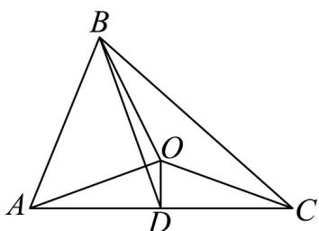
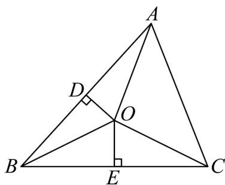

> [!faq]- 《专题22 解三角形精选压轴60题12类考点专练（高效培优期中专项训练）数学人教A版高一必修第二册_57404525》官方解析
>
> > [!success]- **【答案】** $(-2,1)$
>
> > [!note]- **【分析】**
> > 由正弦定理边角互化得 $a \sin B = \sqrt{3}$ ，再结合正弦定理得 $b = 2$ ，设 $AC$ 的中点为 $D$ ，进而根据向
> >
> > 量运算得 $BO \cdot AC = 2 - c$ ，再结合正弦定理求得 $c = 1 + \frac{\sqrt{3}}{\tan B}$ ，最后，根据 $\frac{\pi}{6} < B < \frac{\pi}{2}$ 求解得
> >
> > $\overrightarrow{BO} \cdot \overrightarrow{AC} = 1 - \frac{\sqrt{3}}{\tan B} \in (-2,1)$
>
> > [!note]- **【解析】**
> > 因为 $\sqrt{3}a\cos C + a\sin C = 2\sqrt{3}$ ， $A = \frac{\pi}{3}$ ，
> >
> > 所以 $2a\sin\left(C+\frac{\pi}{3}\right)=2\sqrt{3}$ ，即 $2a\sin\left(C+A\right)=2\sqrt{3}$ ，
> >
> > 因为 $\sin(C+A)=\sin B$ ，所以 $a\sin B=\sqrt{3}$
> >
> > 由正弦定理 $\frac{a}{\sin A} = \frac{b}{\sin B}$ 得 $a \sin B = b \sin A = \frac{\sqrt{3}}{2} b = \sqrt{3}$ ，解得 b = 2，
> >
> > 设 $AC$ 的中点为 $D$ ，则 $OD \perp AC$ ， $OD \cdot AC = 0$ ， $BD = \frac{1}{2}\left( BC + BA \right)$
> >
> > $$
> > \overline {{B O}} \cdot \overline {{A C}} = (\overline {{B D}} + \overline {{D O}}) \cdot \overline {{A C}} = \overline {{B D}} \cdot \overline {{A C}} = \frac {1}{2} (\overline {{B C}} + \overline {{B A}}) \cdot (\overline {{B C}} - \overline {{B A}}) = \frac {1}{2} (\left| \overline {{B C}} \right| ^ {2} - \left| \overline {{B A}} \right| ^ {2}) = \frac {1}{2} (a ^ {2} - c ^ {2})
> > $$
> >
> > 由余弦定理 $a^2 = b^2 + c^2 - 2bc\sin A$ 得 $a^2 - c^2 = b^2 - 2bc\cos A = 4 - 2c$
> >
> > 所以 $BO \cdot AC = \frac{1}{2} \left( a^{2} - c^{2} \right) = 2 - c$
> >
> > 由正弦定理 $\frac{c}{\sin C} = \frac{b}{\sin B}$ 得 $c = \frac{b\sin C}{\sin B} = \frac{2\sin(B + A)}{\sin B} = \frac{2\sin\left(B + \frac{\pi}{3}\right)}{\sin B}$
> >
> > $$
> > = \frac {2 \sin \left(B + \frac {\pi}{3}\right)}{\sin B} = \frac {\sin B + \sqrt {3} \cos B}{\sin B} = 1 + \frac {\sqrt {3}}{\tan B},
> > $$
> >
> > 因为 $\vee ABC$ 为锐角三角形，
> >
> > 所以 $\left\{ \begin{array}{ll}0 <   C = \frac{2\pi}{3} -B <   \frac{\pi}{2}\\ 0 <   B <   \frac{\pi}{2} \end{array} \right.$ ，解得 $\frac{\pi}{6} <  B <   \frac{\pi}{2}$
> >
> > 所以 $\tan B\in\left(\frac{\sqrt{3}}{3},+\infty\right)$ ， $\frac{1}{\tan B}\in\left(0,\sqrt{3}\right)$ ， $-\frac{\sqrt{3}}{\tan B}\in(-3,0)$ ，
> >
> > 所以 $\overrightarrow{BO} \cdot \overrightarrow{AC} = 2 - \left(1 + \frac{\sqrt{3}}{\tan B}\right) = 1 - \frac{\sqrt{3}}{\tan B} \in (-2, 1)$ .
> >
> > 
> >
> > 9. O 为 $\triangle ABC$ 的外心，若 $\frac{\cos A}{\sin C} \cdot \frac{\square\square\square}{BA} + \frac{\cos C}{\sin A} \cdot \frac{\square\square\square}{BC} = m (\cos B + 4) \overline{BO}$ ，则实数 m 的最大值为 \_\_\_\_。
> >
> > 【答案】 $\frac{2\sqrt{15}}{15}/\frac{2}{15}\sqrt{15}$
> >
> > 【分析】首先等式两边点乘 $BO$ ，根据外心的性质，结合向量数量积的几何意义化简等式，再利用正弦定
> >
> > 理，以及两角和的正弦公式化简等式为 $2\sin B - m\cos B = 4m$ ，最后利用辅助角公式和三角函数的性质求
> >
> > 解.
> >
> > 【详解】由条件可知 $\frac{\cos A}{\sin C} \cdot \frac{BA}{BA} \cdot \frac{BO}{BO} + \frac{\cos C}{\sin A} \cdot \frac{BC}{BC} \cdot \frac{BO}{BO} = m (\cos B + 4) BO^2$
> >
> > 如图，因为点 $O$ 是三角形 $\forall ABC$ 的外心，所以点 $O$ 分别向 $AB, BC$ 作垂线，垂足分别为 $D, E$ ，点 $D, E$ 是
> >
> > $AB$ 和 $BC$ 的中点，且设外接圆半径为 $R$ ，
> >
> > 所以 $\overline{BA} \cdot BO = \frac{1}{2} BA^{2} = \frac{1}{2} c^{2}$ ， $BC \cdot BO = \frac{1}{2} BC^{2} = \frac{1}{2} a^{2}$
> >
> > 所以 $\frac{\cos A}{\sin C} \cdot \frac{1}{2} BA^2 + \frac{\cos C}{\sin A} \cdot \frac{1}{2} BC^2 = m (\cos B + 4) BO^2$
> >
> > $$
> > \frac {\cos A \cdot c ^ {2}}{2 \sin C} + \frac {\cos C \cdot a ^ {2}}{2 \sin A} = m (\cos B + 4) R ^ {2}
> > $$
> >
> > $$
> > \text {则} \frac {\sin C \cos A \cdot c ^ {2}}{2 \sin^ {2} C} + \frac {\sin A \cos C \cdot a ^ {2}}{2 \sin^ {2} A} = m (\cos B + 4) R ^ {2},
> > $$
> >
> > $$
> > \sin C \cos A \cdot 2 R ^ {2} + \sin A \cos C \cdot 2 R ^ {2} = m (\cos B + 4) R ^ {2}
> > $$
> >
> > $$
> > 2 \sin (C + A) = m (\cos B + 4), \text {即} 2 \sin B = m (\cos B + 4),
> > $$
> >
> > 则 $2\sin B - m\cos B = 4m$ ，即 $\sqrt{4 + m^2}\sin (B - \varphi) = 4m$
> >
> > $$
> > \text {即} \sin (B - \varphi) = \frac {4 m}{\sqrt {4 + m ^ {2}}} \text {, 即} \left| \frac {4 m}{\sqrt {4 + m ^ {2}}} \right| \leq 1, 1 6 m ^ {2} \leq 4 + m ^ {2},
> > $$
> >
> > 解得： $-\frac{2\sqrt{15}}{15}\leq m\leq \frac{2\sqrt{15}}{15}$
> >
> > $$
> > \frac {2 \sqrt {1 5}}{1 5}
> > $$
> >
> > 所以 $m$ 的最大值为 15 .
> >
> > 
