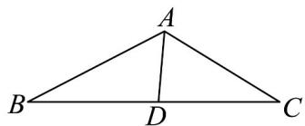

> [!faq]- 《专题22 解三角形精选压轴60题12类考点专练（高效培优期中专项训练）数学人教A版高一必修第二册_57404525》官方解析
>
> > [!success]- **【答案】** $\frac{6}{5}$
>
> > [!note]- **【解析】**
> > 由余弦定理， $BC^{2}=AB^{2}+AC^{2}-2\cdot AB\cdot AC\cos\frac{2\pi}{3}$
> >
> > 所以 $19 = 9 + AC^2 +3AC\Rightarrow AC^2 +3AC - 10 = 0\Rightarrow (AC - 2)(AC + 5) = 0.$
> >
> > 解得 AC = 2 （舍去负根）.
> >
> > 
> >
> > 因为 AD 平分 $\angle BAC$ ，所以 $\angle BAD = \angle CAD = \frac{\pi}{3}$
> >
> > 由 $S_{\triangle ABC} = S_{\triangle ABD} + S_{\triangle ACD}$
> >
> > 得 $\frac{1}{2} AB\cdot AC\sin \frac{2\pi}{3} = \frac{1}{2} AB\cdot AD\sin \frac{\pi}{3} +\frac{1}{2} ACAD\sin \frac{\pi}{3}$
> >
> > $$
> > \frac {1}{2} \cdot 3 \cdot 2 \cdot \frac {\sqrt {3}}{2} = \frac {1}{2} \cdot 3 \cdot A D \frac {\sqrt {3}}{2} + \frac {1}{2} \cdot 2 \cdot A D \cdot \frac {\sqrt {3}}{2}
> > $$
> >
> > 整理得 $AD = \frac{6}{5}$
