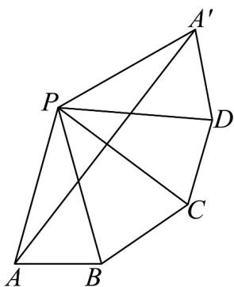

> [!faq]- 《高一数学下学期期中模拟卷_人教A版_高效培优_强化卷_》官方解析
>
> > [!success]- **【答案】** C
>
> > [!note]- **【解析】**
> > 如图，将侧面 PAB，侧面 PBC，侧面 PCD，侧面 PDA 展开到一个平面内。
> >
> > 由题意可知 $PA = PB = PC = PD = PA' = 4$ ， $AB = BC = CD = DA' = 2\sqrt{2}$
> >
> > 设 $\angle APB = \angle BPC = \angle CPD = \angle DPA' = \theta$ ，则 $\cos \theta = \frac{16 + 16 - 8}{2\times 4\times 4} = \frac{3}{4}$
> >
> > 所以 $\cos 2\theta = 2\cos^2\theta -1 = \frac{1}{8}$ ，所以 $\cos 4\theta = 2\cos^2 2\theta -1 = -\frac{31}{32}$
> >
> > 由余弦定理可得 $A^{\prime}A^{2} = 4^{2} + 4^{2} - 2\times 4\times 4\times \left(-\frac{31}{32}\right) = 63$
> >
> > 则 $A^{\prime}A = 3\sqrt{7}$ ，即细绳的最短长度为 $3\sqrt{7}$
> >
> > 
> >
> > 故选：C.
> >
> > 6. 法国数学家棣莫弗（1667-1754年）发现了棣莫弗定理：设两个复数 $z_{1} = r_{1}\left(\cos \theta_{1} + \mathrm{i}\sin \theta_{1}\right)$
> >
> > $z_{2} = r_{2}\left(\cos \theta_{2} + \mathrm{i}\sin \theta_{2}\right)$ ，（ $r_1$ ， $r_2 > 0$ ）则 $z_{1}z_{2} = r_{1}r_{2}\left[\cos \left(\theta_{1} + \theta_{2}\right) + \mathrm{i}\sin \left(\theta_{1} + \theta_{2}\right)\right]$ .设 $z = -\frac{1}{2} +\frac{\sqrt{3}}{2}\mathrm{i}$ ，则 $z^{2024}$
> >
> > 的虚部为（ ）A. $-\frac{1}{2}$ B. $-\frac{1}{2}\mathrm{i}$ C. $-\frac{\sqrt{3}}{2}$ D. $-\frac{\sqrt{3}}{2}\mathrm{i}$
> >
> > 【答案】C
> >
> > 【详解】根据题意，由 $z = -\frac{1}{2} + \frac{\sqrt{3}}{2}\mathrm{i} = \cos \frac{2\pi}{3} + \mathrm{i}\sin \frac{2\pi}{3}$
> >
> > $z^{2024} = \cos \left(2024\times \frac{2\pi}{3}\right) + \sin \left(2024\times \frac{2\pi}{3}\right)\mathrm{i}$ 可得
> >
> > $$
> > = \cos \left(\frac {4 \pi}{3}\right) + \sin \left(\frac {4 \pi}{3}\right) i = - \frac {1}{2} - \frac {\sqrt {3}}{2} i
> > $$
> >
> > 故虚部为 $-\frac{\sqrt{3}}{2}$
> >
> > 故选 **C**
