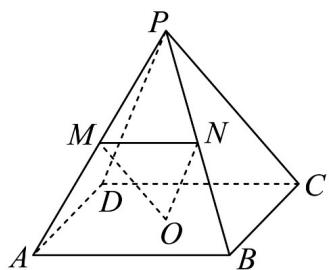

<!-- question-source:start -->
14．如图，在棱长均相等的四棱锥 P-ABCD 中，O 为底面正方形的中心，M，N 分别为侧棱 PA，PB 的

中点，有下列结论：

(1) $PC / /$ 平面 $OMN$ ;

(2) 平面 $PCD \parallel$ 平面 OMN ;

(3) $OM \perp PA$ ;

(4) 直线 $PD$ 与直线 $MN$ 所成角的大小为 $90^{\circ}$

其中正确结论的序号是\_\_\_\_。
<!-- question-source:end -->

![[高中/课堂同步/题库/人教A版高中数学同步讲义(2026)/02_必修第二册/期中专项训练+期中模拟卷/阶段测试/高一数学下学期期中模拟卷_人教A版_高效培优_强化卷_/三_填空题_sec_04/questions/answers/Q00064429A1.md]]
