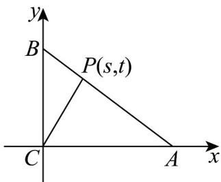

> [!faq]- 《高一数学下学期期中模拟卷_人教A版_高效培优_强化卷_》官方解析
>
> > [!success]- **【答案】** 4 $\frac{3}{2}$
>
> > [!note]- **【解析】**
> > 由 $\sin B = \cos A \sin C$ 可得 $b = c \cos A$ ，又 $AB \cdot AC = cb \cos A = 16$ ，故 $b^{2} = 16$ ，所以 b = 4，
> >
> > 由 $a(1 + \cos B) = b(2 - \cos A)$ 和正弦定理可得 $\sin A + \sin A\cos B = 2\sin B - \sin B\cos A$ ，即
> >
> > $$
> > \sin A + \sin C = 2 \sin B, \text {故} a + c = 2 b = 8
> > $$
> >
> > 又 $\cos A = \frac{b^2 + c^2 - a^2}{2bc} = \frac{b}{c}$ 故 $a^2 + b^2 = c^2$
> >
> > 联立可得 a = 3, b = 4, c = 5，且故 $CB \perp CA$
> >
> > 以 C 为原点、CA, CB 所在直线分别为 x, y 轴建立平面直角坐标系，如图：
> >
> > 
> >
> > 则 $A(4,0)$ ， $B(0,3)$ ， $C(0,0)$ ，设 $P(s,t)$ ，
> >
> > 设 $\overline{AP} = \lambda \overline{PB}, \lambda$ 0 得 $(s - 4, t) = \lambda (-s, 3 - t)$
> >
> > 则 $\left\{ \begin{array}{l} s - 4 = -\lambda s \\ t = \lambda (3 - t) \end{array} \right. \therefore 3s + 4t = 12$
> >
> > 由 $\overrightarrow{CP}=2x\frac{\overrightarrow{CA}}{|CA|}+y\frac{\overrightarrow{CB}}{|CB|}$ 得 $(s,t)=(2x,0)+(0,y)$ ，∴ $\left\{\begin{aligned}s=2x\\ t=y\end{aligned}\right.$ ，∴ $12=6x+4y$ $2\sqrt{6x\cdot4y}$ ，得 $xy\leq\frac{3}{2}$ ，∴ xy 的
> >
> > 最大值为 $\frac{3}{2}$ ，当且仅当 $\left\{ \begin{array}{l} x = 1 \\ y = \frac{3}{2} \end{array} \right.$ 时取等号。
> >
> > 故答案为：4， $\frac{3}{2}$
