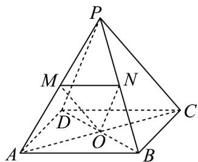

> [!faq]- 《高一数学下学期期中模拟卷_人教A版_高效培优_强化卷_》官方解析
>
> > [!success]- **【答案】** （1）（2）（3）
>
> > [!note]- **【解析】**
> > 如图所示，连接 $AC$ ，因为 $O, M$ 分别为 $AC, PA$ 的中点，可得 $PC // OM$
> >
> > 又因为 $PC \notin$ 平面 OMN， $OM \subset$ 平面 OMN，所以 $PC \parallel$ 平面 OMN，所以（1）正确；
> >
> > 因为 O, N 分别为 AC, PB 的中点，可得 PD // ON，
> >
> > 又因为 $PD \notin$ 平面 OMN， $ON \subset$ 平面 OMN，所以 $PD \parallel$ 平面 OMN，
> >
> > 因为 $PC \cap PD = P$ ，且 $PC, PD \subset$ 平面 PCD，所以平面 $PCD \parallel$ 平面 OMN，所以（2）正确；
> >
> > 由于四棱锥的棱长均相等，所以 $AB^{2} + BC^{2} = PA^{2} + PC^{2} = AC^{2}$ ，所以 $PC \perp PA$ ，
> >
> > 因为 $PC // OM$ ，所以 $OM \perp PA$ ，所以（3）正确.
> >
> > 由于 M ， N 分别为侧棱 PA ， PB 的中点，所以 $MN \parallel AB$ ，
> >
> > 因为四边形 ABCD 为正方形，所以 AB // CD，
> >
> > 所以直线 $PD$ 与直线 $MN$ 所成的角即为直线 $PD$ 与直线 $CD$ 所成的角，即为 $\angle PDC$ 或其补角，
> >
> > 又因为三角形 PDC 为等边三角形，所以 $\angle PDC = 60^{\circ}$ ，所以（4）错误。
> >
> > 故答案为：（1）（2）（3）.
> >
> > 
> >
> > 四、解答题：本题共5小题，共77分。解答应写出文字说明、证明过程或演算步骤。
