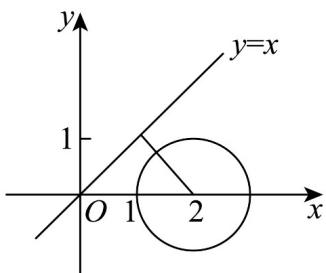

## 三、填空题：本题共3小题，每小题5分，共15分。

12. 复数 $z_{1}, z_{2}$ 满足 $\left|z_{1} - 1\right| = \left|z_{1} - \mathrm{i}\right|, \left|z_{2} - 2\right| = 1$ ，则 $\left|z_{1} - z_{2}\right|$ 的最小值为 \_\_\_\_.

【答案】 $\sqrt{2} - 1 / -1 + \sqrt{2}$

【详解】因为 $\left|z_{1}-1\right|=\left|z_{1}-i\right|$ ，故 $z_{1}$ 对应的点的轨迹为点 $(1,0)$ 和点 $(0,1)$ 为端点的线段中垂线，

故 $z_{1}$ 对应的点的轨迹方程为直线 $y = x$

而 $\left|z_{2}-2\right|=1$ ，故 $z_{2}$ 对应的点的轨迹为圆，其圆心为 $(2,0)$ ，半径为1，

两个轨迹曲线如图所示：

圆心到轨迹直线的距离为 $\frac{|2 - 0|}{\sqrt{2}} = \sqrt{2}$

故圆上的动点到轨迹直线的距离的最小值为 $\sqrt{2} - 1$ ，

而 $\left|z_{1}-z_{2}\right|$ 的几何意义即为 $z_{1}$ 对应的点与 $z_{2}$ 对应的点的连线段的长度，

故其最小值即为 $\sqrt{2} - 1$

故答案为： $\sqrt{2} - 1$

![[高中/课堂同步/题库/人教A版高中数学同步讲义(2026)/02_必修第二册/期中专项训练+期中模拟卷/阶段测试/高一数学下学期期中模拟卷_人教A版_高效培优_强化卷_/三_填空题_sec_04/questions/Q00064428.md]]
![[高中/课堂同步/题库/人教A版高中数学同步讲义(2026)/02_必修第二册/期中专项训练+期中模拟卷/阶段测试/高一数学下学期期中模拟卷_人教A版_高效培优_强化卷_/三_填空题_sec_04/questions/Q00064429.md]]
![[高中/课堂同步/题库/人教A版高中数学同步讲义(2026)/02_必修第二册/期中专项训练+期中模拟卷/阶段测试/高一数学下学期期中模拟卷_人教A版_高效培优_强化卷_/三_填空题_sec_04/questions/Q00064430.md]]
![[高中/课堂同步/题库/人教A版高中数学同步讲义(2026)/02_必修第二册/期中专项训练+期中模拟卷/阶段测试/高一数学下学期期中模拟卷_人教A版_高效培优_强化卷_/三_填空题_sec_04/questions/Q00064431.md]]
![[高中/课堂同步/题库/人教A版高中数学同步讲义(2026)/02_必修第二册/期中专项训练+期中模拟卷/阶段测试/高一数学下学期期中模拟卷_人教A版_高效培优_强化卷_/三_填空题_sec_04/questions/Q00064432.md]]
![[高中/课堂同步/题库/人教A版高中数学同步讲义(2026)/02_必修第二册/期中专项训练+期中模拟卷/阶段测试/高一数学下学期期中模拟卷_人教A版_高效培优_强化卷_/三_填空题_sec_04/questions/Q00064433.md]]
![[高中/课堂同步/题库/人教A版高中数学同步讲义(2026)/02_必修第二册/期中专项训练+期中模拟卷/阶段测试/高一数学下学期期中模拟卷_人教A版_高效培优_强化卷_/三_填空题_sec_04/questions/Q00064434.md]]
