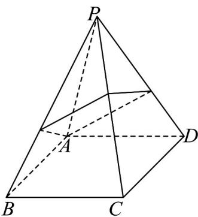

<!-- question-source:start -->
5．如图，在正四棱锥 P-ABCD 中，PA=4， $AB=2\sqrt{2}$ ．从 A 拉一条细绳绕过侧棱 PB，PC，PD 回到 A

点，则细绳的最短长度为（）

A. $2\sqrt{2} + 2\sqrt{7}$ B. $2\sqrt{7} + 2$ C. $3\sqrt{7}$ D. $8\sqrt{2}$
<!-- question-source:end -->

![[高中/课堂同步/题库/人教A版高中数学同步讲义(2026)/02_必修第二册/期中专项训练+期中模拟卷/高一数学下学期期中模拟卷（人教A版必修第二册第六章~第八章，高效培优·强化卷）/一_选择题/questions/answers/Q00077592A1.md]]
