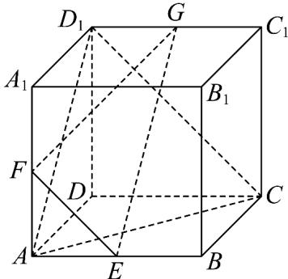

<!-- question-source:start -->
8．已知正方体 $ABCD-A_{1}B_{1}C_{1}D_{1}$ 中，点 E，F，G 分别为棱 AB， $AA_{1}$ ， $C_{1}D_{1}$ 的中点，给出下列四个结论：

其中不正确结论是（）

A. 直线 $FG$ 与平面 $ACD_{1}$ 相交；

B. $B_{1}D \perp$ 平面 EFG ;

C．若 AB=1，则点 D 到平面 $ACD_{1}$ 的距离为 $\frac{\sqrt{3}}{3}$ ；

D．该正方体的棱所在直线与平面 EFG 所成的角都相等．
<!-- question-source:end -->

![[高中/课堂同步/题库/人教A版高中数学同步讲义(2026)/02_必修第二册/期中专项训练+期中模拟卷/高一数学下学期期中模拟卷（人教A版必修第二册第六章~第八章，高效培优·强化卷）/一_选择题/questions/answers/Q00077594A1.md]]
