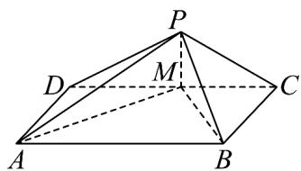

<!-- question-source:start -->
11．如图，已知底面为矩形的四棱锥 P-ABCD 的顶点 P 的位置不确定，点 M 在棱 CD 上，且 $AM \perp BM$ ，

平面 $PAM \perp$ 平面 $ABCD$ ，则下列结论正确的是（）

A. $PA \perp BM$

B．平面PAM⊥平面PBM

C．存在某个位置，使平面 PAM 与平面 PBC 的交线与底面 ABCD 平行

D．若 $AD = 2\sqrt{3}, MD = 2$ ，则直线 CM 与平面 PAM 所成角为 $\frac{\pi}{3}$
<!-- question-source:end -->

![[高中/课堂同步/题库/人教A版高中数学同步讲义(2026)/02_必修第二册/期中专项训练+期中模拟卷/高一数学下学期期中模拟卷（人教A版必修第二册第六章~第八章，高效培优·强化卷）/一_选择题/questions/answers/Q00077597A1.md]]
