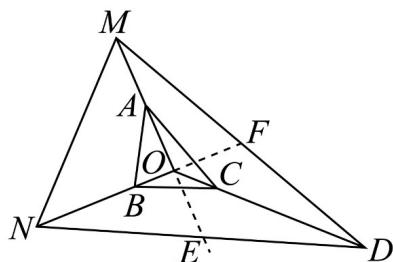

> [!faq]- 《高一数学下学期期中模拟卷（人教A版必修第二册第六章~第八章，高效培优·强化卷）》官方解析
>
> > [!success]- **【答案】** A. $O$ 是 $\triangle MND$ 的外心 B. $O$ 是 $\triangle MND$ 的重心 C. $S_{\triangle MNO} = 6S_{\triangle ABO}$ D. $2S_{\triangle DMO} = S_{\triangle DNO}$
>
> > [!note]- **【解析】**
> > ∵点 A 为 OM 的中点， $NB = 2BO$ ， $DC = 3CO$ ，∴ OM = 2OA，ON = 3OB，OD = 4OC。
> >
> > $$
> > \text { 又 } 2 O A + 3 O B = 4 C O, \therefore O M + O N - 4 C O = O M + O N + O D = 0.
> > $$
> >
> > 取 ND 的中点 E，MD 的中点 F，连接 OE，OF，如图所示.
> >
> > 
> >
> > 则由向量的加法法则可知： $ON + OD = 2OE$ ， $OM + OD = 2OF$ ，∴ $OM = -2OE$ ， $ON = -2OF$ 。
> >
> > $\therefore O, M, E$ 三点共线， $O, N, F$ 三点共线， $\therefore$ 点 $O$ 为中线 $NF$ 和 $ME$ 的交点，即 $O$ 是 $\triangle MND$ 的重心，故
> >
> > 选项A错误，选项B正确；
> >
> > 又 $S_{\triangle MNO} = \frac{1}{2} OM\cdot ON\cdot \sin \angle MON = \frac{1}{2}\times 2OA\times 3OB\cdot \sin \angle MON = 6\times \frac{1}{2} OA\cdot OB\cdot \sin \angle AOB = 6S_{\triangle ABO}$ ，故选项C正
> >
> > 确；
> >
> > $$
> > \because S _ {\triangle M N O} = 2 S _ {\triangle O N E} = 2 S _ {\triangle O D E} = S _ {\triangle O M D}, \therefore S _ {\triangle D N O} = S _ {\triangle E N O} + S _ {\triangle D E O} = S _ {\triangle D M O}, \text {故选项D错误.}
> > $$
> >
> > 故选 **BC**.
