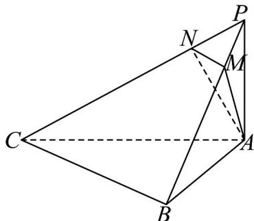

<!-- question-source:start -->
18. (17 分)

如图，在三棱锥 $P - ABC$ 中， $PA \perp$ 底面 $ABC$ ， $\angle ABC = 90^{\circ}$ ， $PA = 2$ ， $AC = 2\sqrt{2}$

(1)求证：平面 $PBC \perp$ 平面 PAB；

(2)若二面角 $P - BC - A$ 的大小为 $45^{\circ}$ ，点 $N$ 在 $PC$ 上且 $PN = \frac{2\sqrt{3}}{3}$ ，过 $AN$ 的截面平行于 $BC$ 交 $PB$ 于 $M$ 。求：

①截面分三棱锥 P-ABC 得到的两个几何体的体积比 $V_{BCAMN}$ 的值

$$
\frac {V _ {P - A N M}}{V _ {B C A M N}}
$$

②直线 AN 与平面 PBC 所成角的大小.
<!-- question-source:end -->

![[高中/课堂同步/题库/人教A版高中数学同步讲义(2026)/02_必修第二册/期中专项训练+期中模拟卷/高一数学下学期期中模拟卷（人教A版必修第二册第六章~第八章，高效培优·强化卷）/三_填空题/questions/answers/Q00077603A1.md]]
