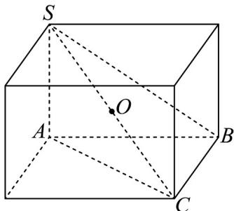
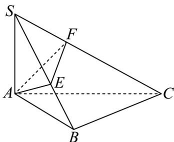

> [!faq]- 《高一数学下学期期中模拟卷（人教A版必修第二册第六章~第八章，高效培优·强化卷）》官方解析
>
> > [!success]- **【答案】** (1) $\frac{4}{3}$ (2)证明见解析 (3)证明见解析
>
> > [!note]- **【解析】**
> > （1）因为 $SA \perp$ 平面 ABC，所以 SA 为三棱锥 S-ABC 的高，
> >
> > 又 $\angle ABC = 90^{\circ}$ ， $SA = AB = BC = 2$
> >
> > 所以三棱锥 S-ABC 的体积为 $\frac{1}{3}S_{\triangle ABC} \cdot SA = \frac{1}{3} \times \frac{1}{2} \times 2 \times 2 \times 2 = \frac{4}{3}$ ;
> >
> > (2) 因为 $SA \perp$ 平面 $ABC$ ， $BC \subset$ 平面 $ABC$ ，所以 $SA \perp BC$ ，
> >
> > 因为 $\angle ABC = 90^{\circ}$ ，所以 $BC\perp AB$ ，因为 $AB\cap SA = A$ ， $AB,SA\subset$ 平面 $SAB$
> >
> > 所以 $BC \perp$ 平面 SAB ，将三棱锥 S-ABC 补全成长方体，如图，
> >
> > 
> >
> > 则三棱锥 S-ABC 外接球即为长方体的外接球，其球心 O 为 SC 的中点，
> >
> > 由 $SA \perp$ 平面 $ABC$ 知球心 $O$ 到平面 $ABC$ 的距离为 $\frac{1}{2} SA$
> >
> > 由 $BC \perp$ 平面 $SAB$ 知球心 $O$ 到平面 $SAB$ 的距离为 $\frac{1}{2} BC$
> >
> > 因为平面 $SAB$ 与平面 $ABC$ 截三棱锥 $S - ABC$ 外接球所得截面面积相等，即截面圆的半径相等，
> >
> > 设球 O 的半径为 R，两截面圆的半径为 r，
> >
> > 则根据球的性质有 $R^2 = r^2 + \left(\frac{1}{2} SA\right)^2$ ， $R^2 = r^2 + \left(\frac{1}{2} BC\right)^2$
> >
> > 所以 $\frac{1}{2} SA = \frac{1}{2} BC$ ，即 $SA = BC$ ；
> >
> > (3)
> >
> > 
> >
> > 由（2）知 $BC \perp$ 平面 $SAB$ ，因为 $AE \subset$ 平面 $SAB$ ，
> >
> > 所以 $BC \perp AE$ ，
> >
> > 因为 $AE \perp SB$ ， $SB \cap BC = B$ ， $SB, BC \subset$ 平面 SBC，
> >
> > 所以 $AE \perp$ 平面 SBC ，
> >
> > 因为 $SC \subset$ 平面 SBC ，所以 $AE \perp SC$
> >
> > 因为 $AF \perp SC$ ， $AE \cap AF = A$ ， $AE, AF \subset$ 平面 AEF，
> >
> > 所以 $SC \perp$ 平面 AEF ，
> >
> > 因为 $EF \subset$ 平面 $AEF$ ，
> >
> > 所以 $SC \perp EF$ .
