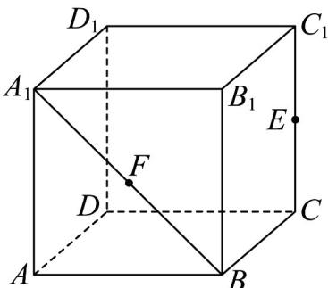

<!-- question-source:start -->
7．如图，在棱长为2的正方体中 $ABCD - A_{1}B_{1}C_{1}D_{1}$ ， $E$ 为线段 $CC_{1}$ 的中点， $F$ 为线段 $A_{1}B$ 上的动点（含端

点），则下列结论不正确的是（）

A. 直线 $A_{1}B$ 与直线 $CC_{1}$ 异面

B．过 $A, D_{1}, E$ 三点的平面截正方体 $ABCD - A_{1}B_{1}C_{1}D_{1}$ 所得的截面的面积为 $\frac{9}{2}$ C．当 $F$ 在线段 $A_{1}B$ 上运动时，三棱锥 $C - AFD_{1}$ 的体积不变

D．存在点 $F$ ，使得直线 $EF //$ 平面 $AD_{1}C$
<!-- question-source:end -->

![[高中/课堂同步/题库/人教A版高中数学同步讲义(2026)/02_必修第二册/期中专项训练+期中模拟卷/高一数学下学期期中模拟卷（人教A版必修第二册第六章~第八章，高效培优·提升卷）/一_选择题/questions/answers/Q00077609A1.md]]
