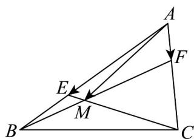
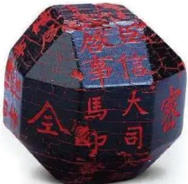
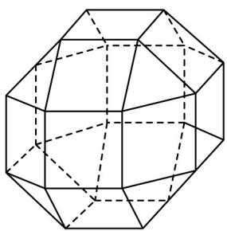
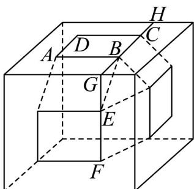

> [!faq]- 《高一数学下学期期中模拟卷（人教A版必修第二册第六章~第八章，高效培优·提升卷）》官方解析
>
> > [!success]- **【答案】**  A.0 B. $\frac{3}{7}$ C. $\frac{6}{7}$ D.1
>
> > [!note]- **【解析】**
> > 因为 B、M、F 三点共线，且 $\overline{AE} = \frac{2}{3} \overline{AB}$
> >
> > 所以 $AM = (1 - y)AB + yAF = \frac{3}{2}(1 - y)AE + yAF$
> >
> > 又因为 C、M、E 三点共线，且 $\overline{AF} = \frac{1}{3} \overline{AC}$
> >
> > 所以 $AM = xAE + (1 - x)AB = xAE + 3(1 - x)AF$
> >
> > 可得 $\frac{3}{2}\left(1 - y\right)AE + yAF = xAE + 3(1 - x)AF$
> >
> > 即 $\left\{\begin{aligned}\frac{3}{2}(1-y)=x\\ y=3(1-x)\end{aligned}\right.$
> >
> > 解得 $\left\{\begin{aligned}x&=\frac{6}{7}\\ y&=\frac{3}{7}\end{aligned}\right.$
> >
> > 所以 $x-2y=\frac{6}{7}-2\times\frac{3}{7}=0$
> >
> > 故选：A
> >
> > 4．中国有悠久的金石文化，印信是金石文化的代表之一．印信的形状多为长方体、正方体或圆柱体，但
> >
> > 南北朝时期的官员独孤信的印信形状是“半正多面体”（图1）．半正多面体是由两种或两种以上的正多边形
> >
> > 围成的多面体.半正多面体体现了数学的对称美．图2是一个棱数为48的半正多面体，它的所有顶点都在
> >
> > 同一个正方体的表面上，且此正方体的棱长为 $1$ 。则该半正多面体的棱长为（）
> >
> > 
> > 图1
> >
> > 
> > 图2
> >
> > A. $2 - \sqrt{2}$ B. $\sqrt{2} -1$ C. $\frac{\sqrt{2}}{4}$ D. $\frac{1}{3}$
> >
> > 【答案】B
> >
> > 【详解】如图，设该半正多面体的棱长为 $x$ ，则 $AB = BE = x$
> >
> > 延长 CB 与 FE 交于点 G ，延长 BC 交正方体棱于 H ，
> >
> > 由半正多面体对称性可知， $\triangle BGE$ 为等腰直角三角形，
> >
> > $BG = GE = CH = \frac{\sqrt{2}}{2} x$ $GH = 2\times \frac{\sqrt{2}}{2} x + x = (\sqrt{2} +1)x = 1$
> >
> > $x = \frac{1}{\sqrt{2} + 1} = \sqrt{2} - 1$ 即该半正多面体棱长为 $\sqrt{2} - 1$
> >
> > 
> >
> > 故选 **B**
