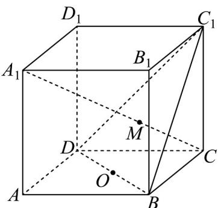

> [!faq]- 《高一数学下学期期中模拟卷（人教A版必修第二册第六章~第八章，高效培优·提升卷）》官方解析
>
> > [!success]- **【答案】**  A. $A, C, C_1, A_1$ 四点共面 B. $C_1, M, O$ 三点共线 C. $M \in$ 平面 $BB_{1}D_{1}D$ D. $A_{1}C$ 与 $BD$ 异面
>
> > [!note]- **【解析】**
> > 对于 A 选项， $AA_{1} // CC_{1}$ 且 $AA_{1} = CC_{1}$ ，所以 A, C, $C_{1}$ , $A_{1}$ 共面，故 A 正确；
> >
> > 对于 B 选项，直线 $A_{1}C \cap$ 平面 $C_{1}BD = M$ ，所以 $M \in$ 平面 $C_{1}BD$ ，
> >
> > 因为 $M \in$ 直线 $A_{1}C$ ，又 $A_{1}C \subset$ 平面 $ACC_{1}A_{1}$ ，所以 $M \in$ 平面 $ACC_{1}A_{1}$ ，
> >
> > 因为 O 为 BD 中点， $BD \subset$ 平面 $C_{1}BD$ ，所以 $O \in$ 平面 $C_{1}BD$ ，
> >
> > 底面 ABCD 为正方形，所以 O 为 AC 中点， $AC \subset$ 平面 $ACC_{1}A_{1}$ ，所以 $O \in$ 底面 $ACC_{1}A_{1}$ ，
> >
> > 又 $C_1 \in$ 平面 $ACC_1A_1$ ， $C_1 \in$ 平面 $C_1BD$
> >
> > 所以平面 $C_{1}BD$ 与平面 $ACC_{1}A_{1}$ 相交，且 $C_{1}, M, O$ 在交线上，即 $C_{1}, M, O$ 三点共线，故 B 正确；
> >
> > 对于选项 C，平面 $C_{1}BD \cap$ 平面 $BB_{1}D_{1}D = BD$ ， $M \in$ 平面 $C_{1}BD$ ，但 $M \notin$ 直线 BD，
> >
> > 所以 $M \notin$ 平面 $BB_{1}D_{1}D$ ，故 C 错误；
> >
> > 对于选项 D，直线 $A_{1}C \cap$ 平面 ABCD = C ，直线 BD ⊂ 平面 ABCD ，M $\notin BD$ ，
> >
> > 所以直线 $A_{1}C$ 与 BD 为异面直线，故 D 正确.
> >
> > 故选 **C**
