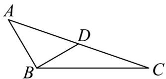

> [!faq]- 《高一数学下学期期中模拟卷（人教A版必修第二册第六章~第八章，高效培优·提升卷）》官方解析
>
> > [!success]- **【答案】** A. $\sqrt{3}$ B. $\frac{\sqrt{3}}{3}$ C. $2\sqrt{3}$ D. $\frac{2\sqrt{3}}{3}$
>
> > [!note]- **【解析】**
> > 
> >
> > 因为 $\angle ABC = \frac{2\pi}{3}$ ， $\angle DBC = \frac{\pi}{6}$
> >
> > 所以 $\angle ABD = \frac{2\pi}{3} - \frac{\pi}{6} = \frac{\pi}{2}$ .
> >
> > 又因为 BD = 1 ，
> >
> > 所以 $S_{VABD}=\frac{1}{2}\times BD\times AB=\frac{1}{2}c$ ， $S_{VCBD}=\frac{1}{2}\times BD\times BC\times\sin\angle DBC=\frac{1}{4}b$
> >
> > 根据等面积法可得： $S_{\triangle ABC} = S_{\triangle ABD} + S_{\triangle CBD}$ ，即 $\frac{1}{2} ac\sin \frac{2\pi}{3} = \frac{c}{2} +\frac{a}{4}$
> >
> > 整理得 $\sqrt{3}ac = 2c + a$ .
> >
> > 由基本不等式可得： $2c + a = 2\sqrt{2ac}$ ，当且仅当2c = a时等号成立.
> >
> > 则 $\sqrt{3}ac$ $2\sqrt{2ac}$ ，解得： $ac \frac{8}{3}$ ，此时 $a=\frac{4\sqrt{3}}{3}$ ， $c=\frac{2\sqrt{3}}{3}$ 时等号成立.
> >
> > 故 $S_{\triangle ABC} = \frac{1}{2} ac \sin \frac{2\pi}{3} = \frac{\sqrt{3}}{4} ac$ $\frac{\sqrt{3}}{4} \times \frac{8}{3} = \frac{2\sqrt{3}}{3}$ .
> >
> > 故选 **D**
