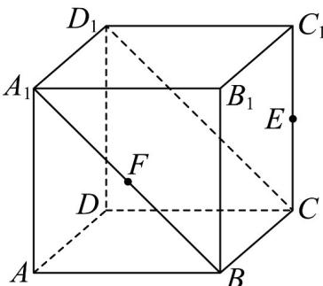
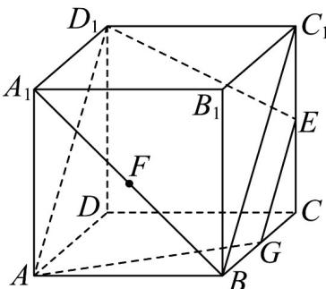
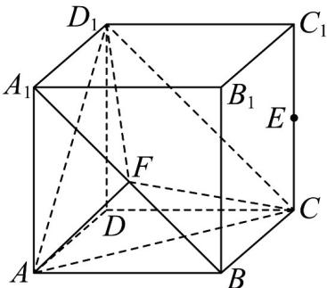
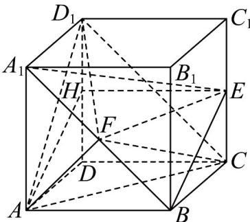
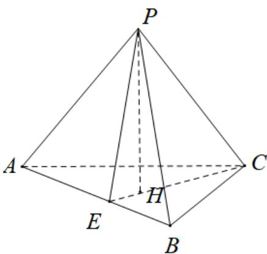

> [!faq]- 《高一数学下学期期中模拟卷（人教A版必修第二册第六章~第八章，高效培优·提升卷）》官方解析
>
> > [!success]- **【答案】** D
>
> > [!note]- **【解析】**
> > 对于 A，如图所示，由题意 $A_{1}D_{1} // BC, A_{1}D_{1} = BC$ ，从而四边形 $A_{1}D_{1}CB$ 是平行四边形，
> > 所以 $A_{1}B // D_{1}C$ ，而 $D_{1}C \cap CC_{1} = C$ ，所以直线 $A_{1}B$ 与直线 $CC_{1}$ 异面，故 A 正确；
> >
> > 
> >
> > 对于 B，如图所示，设点 G 为 BC 的中点，因为 E 为 $CC_{1}$ 的中点，
> >
> > 所以 $GE \parallel BC_{1}$
> >
> > 又因为 $AB / / C_1D_1, AB = C_1D_1$ ，所以四边形 $ABC_1D_1$ 为平行四边形，所以 $BC_1 / / AD_1$
> >
> > 所以 $GE // AD_{1}$
> >
> > 所以过 $A, D_{1}, E$ 三点的平面截正方体 $ABCD - A_{1}B_{1}C_{1}D_{1}$ 所得的截面的面积为梯形 $GED_{1}A$ 的面积，
> >
> > 
> >
> > 由勾股定理得 $AD_{1} = 2\sqrt{2},GE = \frac{1}{2} AD_{1} = \sqrt{2},AG = D_{1}E = \sqrt{1 + 4} = \sqrt{5}$
> >
> > 故梯形 $GED_{1}A$ 的高为 $h = \sqrt{5 - \left(\frac{2\sqrt{2} - \sqrt{2}}{2}\right)^{2}} = \frac{3\sqrt{2}}{2}$
> >
> > 故所求为 $\frac{1}{2} \times \left( \sqrt{2} + 2\sqrt{2} \right) \times \frac{3\sqrt{2}}{2} = \frac{9}{2}$ ，故 B 正确；
> >
> > 对于 C，如图所示，由 A 可知 $A_{1}B // D_{1}C$
> >
> > 又因为 $A_{1}B \not\subset$ 平面 $AD_{1}C$ ， $D_{1}C \subset$ 平面 $AD_{1}C$ ，
> >
> > 所以 $A_{1}B \parallel$ 平面 $AD_{1}C$ ,
> >
> > 显然三角形 $A_{1}DC$ 的面积是定值，且点 $F$ 到平面 $A_{1}DC$ 的距离等于点 $B$ 到平面 $A_{1}DC$ 的距离也为定值，故C
> >
> > 正确；
> >
> > 
> >
> > 对于 D，如图所示，设 H 为 $DD_{1}$ 的中点，
> >
> > 因为 $A_{1}B // D_{1}C$ ， $A_{1}B \notin$ 平面 $AD_{1}C$ ， $D_{1}C \subset$ 平面 $AD_{1}C$ ，
> >
> > 所以 $A_{1}B \parallel$ 平面 $AD_{1}C$
> >
> > 若直线 EF // 平面 $AD_{1}C$ ，
> >
> > 又因为 $A_{1}B \cap EF = F, A_{1}B, EF \subset$ 平面 $A_{1}BE$
> >
> > 所以平面 $A_{1}BE \parallel$ 平面 $AD_{1}C$
> >
> > 又因为 $BE \subset$ 平面 $A_{1}BE$ ，所以 $BE \parallel$ 平面 $AD_{1}C$ ，
> >
> > 因为 $H, E$ 分别为正方形 $DD_{1}C_{1}C$ 的边 $DD_{1}, CC_{1}$ 的中点，所以 $HE // DC, HE = DC$
> >
> > 又因为 $DC \parallel AB, DC = AB$
> >
> > 所以 $HE \parallel AB, HE = AB$
> >
> > 所以四边形 HEBA 是平行四边形，所以 BE // AH
> >
> > 而直线 AH 与平面 $AD_{1}C$ 相交，所以直线 BE 与平面 $AD_{1}C$ 相交，
> >
> > 这与 BE // 平面 $AD_{1}C$ 矛盾，故假设直线 EF // 平面 $AD_{1}C$ 不成立，故 D 错误.
> >
> > 
> >
> > 故选：D.
> >
> > 8. 类比思想是学习数学的一种重要的思想方法，是指依据两类数学对象的相似性，将已知的一类数学对
> >
> > 象的性质迁移到另一类数学对象上去的一种思维方法．在平面几何中，有如下命题“正三角形 ABC 的高为
> >
> > $h, O$ 是VABC内任意一点， $O$ 到三边的距离分别为 $d_{1}, d_{2}, d_{3}$ ，则 $\frac{d_1 + d_2 + d_3}{h}$ 为定值”。证明如下：设正三角
> >
> > 形 $ABC$ 边长为 $a$ ，高 $h,O$ 到三边的距离分别 $d_{1},d_{2},d_{3}$ ，则： $S_{\triangle AOB} + S_{\triangle BOC} + S_{\triangle COA} = S_{\triangle ABC}$ ，即：
> >
> > $\frac{1}{2} ad_{1} + \frac{1}{2} ad_{2} + \frac{1}{2} ad_{3} = \frac{1}{2} ah$ ，化简得， $d_{1} + d_{2} + d_{3} = h$ ， $\therefore \frac{d_1 + d_2 + d_3}{h} = 1$ （定值）.类比此命题及证明方法，
> >
> > 在立体几何中可解决以下问题，正四面体 $P - ABC$ 中， $AB = 6$ ，若点 $M$ 是正四面体 $P - ABC$ 内任意一点，
> >
> > 点 $M$ 到平面 $ABC$ ，平面 $PAB$ ，平面 $PBC$ ，平面 $APC$ 的距离分别为 $d_{1}, d_{2}, d_{3}, d_{4}$ ，则 $d_{1} + d_{2} + d_{3} + d_{4} =$
> >
> > ( )
> >
> > A. $2\sqrt{2}$ B. $2\sqrt{3}$ C. $2\sqrt{5}$ D. $2\sqrt{6}$
> >
> > 【答案】D
> >
> > 【详解】
> >
> > 
> >
> > 如图，正四面体 $P - ABC$ 的棱长为6，设点 $H$ 为点 $P$ 在底面 $ABC$ 上的射影，连接 $CH$ 并延长交 $AB$ 于点 $E$ ，连接 $PE$ ，则 $PE = CE = \frac{\sqrt{3}}{2} \times 6 = 3\sqrt{3}$ ， $EH = \frac{1}{3} CE = \sqrt{3}$ 故正四面体的高为 $PH = \sqrt{PE^2 - EH^2} = \sqrt{(3\sqrt{3})^2 - (\sqrt{3})^2} = 2\sqrt{6}$ ，且各侧面的面积为 $S = \frac{1}{2} \times 6 \times 3\sqrt{3} = 9\sqrt{3}$ ，由 $V_{P - ABC} = V_{M - ABC} + V_{M - PAB} + V_{M - PBC} + V_{M - APC}$ ，可得 $\frac{1}{3} \times 9\sqrt{3} \times 2\sqrt{6} = \frac{1}{3} \times 9\sqrt{3} \times (d_1 + d_2 + d_3 + d_4)$ ，解得 $d_1 + d_2 + d_3 + d_4 = 2\sqrt{6}$ .
> >
> > 故选：D
> >
> > ## 二、选择题：本题共3小题，每小题6分，共18分．在每小题给出的选项中，有多项符合题目要求．全部选对的得6分，部分选对的得部分分，有选错的得0分.
