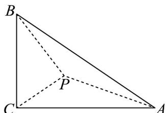

> [!faq]- 《高一数学下学期期中模拟卷（人教A版必修第二册第六章~第八章，高效培优·提升卷）》官方解析
>
> > [!success]- **【答案】** ( ) A. $C = \frac{\pi}{2}$ B．若 $a = 2b\sin A$ ，则 $A = \frac{\pi}{4}$ C．若 c=2，VABC 面积的最大值为 1 D．P 是 VABC 内部的动点，满足 $\angle APB = \angle BPC = \angle CPA = \frac{2\pi}{3}$ ，若 $\left|PA\right| + \left|PB\right| = \lambda \left|PC\right|$ ，则实数 $\lambda$ 的最 小值为 $2\sqrt{3} + 2$
>
> > [!note]- **【解析】**
> > 由正弦定义以及 $c\cos B = b\cos C + a$ ，可得 $\sin C\cos B = \sin B\cos C + \sin A$
> >
> > 因为在VABC中， $\sin A=\sin(B+C)$
> >
> > 所以 $\sin C\cos B = \sin B\cos C + \sin B\cos C + \cos B\sin C$ ，化简得： $\sin B\cos C = 0$
> >
> > 因为在 VABC 中， $\sin B \neq 0$ ，所以 $\cos C = 0$ ，由于 $C \in (0, \pi)$ ，故 $C = \frac{\pi}{2}$ ，故 A 正确；
> >
> > 对于B，由 $a = 2b\sin A$ ，可得 $\sin A = 2\sin B\sin A$ ，由于 $\sin A\neq 0$ ，所以 $\sin B = \frac{1}{2}$ ，由于 $C = \frac{\pi}{2}$ ，所以 $B = \frac{\pi}{6}$
> >
> > $A=\frac{\pi}{3}$ ，故 B 不正确；
> >
> > 对于 C，已知 $C=\frac{\pi}{2}$ ，c=2，则 $a^{2}+b^{2}=4$ ， $S_{VABC}=\frac{1}{2}ab\leq\frac{a^{2}+b^{2}}{4}=1$
> >
> > 当且仅当 $a = b = \sqrt{2}$ 时取等号，所以VABC面积的最大值为1，故C正确；
> >
> > 对于D，设 $|PA|=x$ ， $|PB|=y$ ， $|PC|=z$ ，因为 $\angle APB=\angle BPC=\angle CPA=\frac{2\pi}{3}$
> >
> > 
> >
> > 所以在 $\triangle ABP$ 中， $c^2 = AB^2 = x^2 + y^2 + xy$
> >
> > 同理可得： $a^2 = BC^2 = y^2 +z^2 +yz$ ， $b^{2} = AC^{2} = z^{2} + x^{2} + xz$
> >
> > 因为 $C=\frac{\pi}{2}$ ，所以 $a^{2}+b^{2}=c^{2}$ ，所以 $y^{2}+z^{2}+yz+z^{2}+x^{2}+xz=x^{2}+y^{2}+xy$ ，
> >
> > 化简得： $xy = 2z^{2} + yz + xz = 2z^{2} + z(x + y)$
> >
> > $$
> > \left| P A \right| + \left| P B \right| = \lambda \left| P C \right|
> > $$
> >
> > $$
> > x + y = \lambda z
> > $$
> >
> > $$
> > x y = 2 z ^ {2} + y z + x z = 2 z ^ {2} + \lambda z ^ {2} \leq \left(\frac {x + y}{2}\right) ^ {2} = \frac {\lambda^ {2} z ^ {2}}{4}
> > $$
> >
> > $x = y$ 时取等号；
> >
> > 所以 $2z^{2} + \lambda z^{2}\leq \frac{\lambda^{2}z^{2}}{4}$ ，化简得： $\lambda^2 -4\lambda -80$ ，解得 $\lambda 2 + 2\sqrt{3}$ 或 $\lambda \leq 2 - 2\sqrt{3}$ （舍去），
> >
> > 所以实数 $\lambda$ 的最小值为 $2\sqrt{3} + 2$ ，故D正确；
> >
> > 故选 **ACD**
