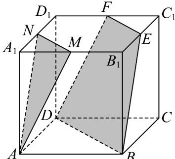
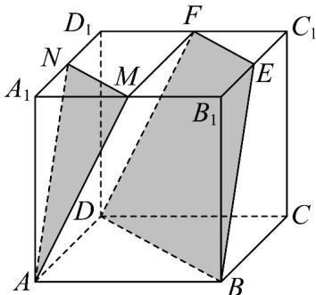
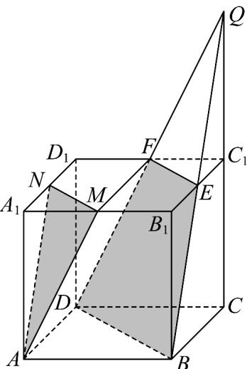

> [!faq]- 《高一数学下学期期中模拟卷（人教A版必修第二册第六章~第八章，高效培优·提升卷）》官方解析
>
> > [!success]- **【答案】**  A. 若正方体的各顶点都在同一球面上，则该球的表面积为 $4\pi$ B. 平面 $AMN //$ 平面 $EFDB$ C. 异面直线 $AM$ 与 $BE$ 所成角的余弦值为 $\frac{4}{5}$ D. 平面 $AMN$ 和平面 $EFDB$ 分正方体 $ABCD - A_1B_1C_1D_1$ 成三部分的体积由小到大的比值为1:8:16
>
> > [!note]- **【解析】**
> > 对于 A，正方体的外接球的直径为 $AC_{1}=\sqrt{2^{2}+2^{2}+2^{2}}=2\sqrt{3}$ ，故外接球的半径为 $R=\sqrt{3}$ ，故体积
> >
> > 为 $4\pi R^{2}=12\pi$ ，故 A 错，
> >
> > 对于 B，连接 EM，由正方体性质可得四边形 AMFD 为平行四边形，故 AM // DF
> >
> > 而 $AM \not\subset$ 平面 BDFE ， $DF \subset$ 平面 BDFE ， 故 $AM \parallel$ 面 BDFE ，
> >
> > 
> >
> > 同理 $AN //$ 面 $BDFE$ ，又 $AM$ 与 $AN$ 相交，且 $AM, AN \subset$ 平面 $AMN$
> >
> > 则面 AMN // 面 BDFE，故 B 正确，
> >
> > 对于 C，由于 AN // BE，因此 $\angle NAM$ 或其补角为异面直线 AM 与 BE 所成角，
> >
> > $$
> > A N = A M = \sqrt {2 ^ {2} + 1 ^ {2}} = \sqrt {5} \quad N M = \sqrt {2}
> > $$
> >
> > 由余弦定理可得 $\cos\angle NAM=\frac{AN^{2}+AM^{2}-NM^{2}}{2AN\cdot AM}=\frac{(\sqrt{5})^{2}+(\sqrt{5})^{2}-(\sqrt{2})^{2}}{2(\sqrt{5})\cdot(\sqrt{5})}=\frac{4}{5}$
> >
> > 故C正确，
> >
> > 对于 D， $V_{A_{1}-AMN}=V_{A-A_{1}MN}=\frac{1}{3}\times\frac{1}{2}\times1\times1\times2=\frac{1}{3}$ ，延长 $CC_{1}$ 和 BE 相交于点 Q，
> >
> > 由于 E 是 $B_{1}C_{1}$ 的中点， $EC_{1}\parallel BC$ ，所以 $C_{1}$ 是 QC 的中点，
> >
> > 同理可知 DF 与 $CC_{1}$ 也相交于点 Q，故 $EFC_{1}-DBC$ 为三棱台，
> >
> > $$
> > V _ {E F C _ {1} - D B C} = \frac {1}{3} \left(\frac {1}{2} \times 1 \times 1 + \frac {1}{2} \times 2 \times 2 + \sqrt {\frac {1}{2} \times 1 \times 1 \times \frac {1}{2} \times 2 \times 2}\right) \times 2 = \frac {7}{3}
> > $$
> >
> > 因此平面 $AMN$ 和平面 $EFDB$ 之间的体积为：
> >
> > $$
> > V _ {\text {正方体}} - V _ {E F C _ {1} - D B C} - V _ {A _ {1} - A M N} = 2 \times 2 \times 2 - \frac {1}{3} - \frac {7}{3} = \frac {1 6}{3},
> > $$
> >
> > 因此三部分的体积由小到大的比值为 1:7:16，D 错误。
> >
> > 
> >
> > 故选 **BC**.
