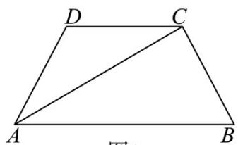
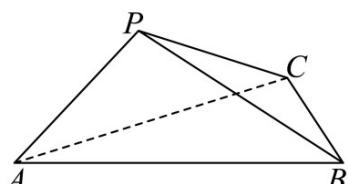

<!-- question-source:start -->
13．如图1，在梯形ABCD中， $AB//CD$ ，AB=2，AD=CD=CB=1，将 $\triangle ACD$ 沿AC折起，使得点D落

在点 $P$ 的位置，得到三棱锥 $P - ABC$ ，如图2所示，则三棱锥 $P - ABC$ 体积的最大值为

图1

图2
<!-- question-source:end -->

![[高中/课堂同步/题库/人教A版高中数学同步讲义(2026)/02_必修第二册/期中专项训练+期中模拟卷/高一数学下学期期中模拟卷（人教A版必修第二册第六章~第八章，高效培优·提升卷）/三_填空题/questions/answers/Q00077614A1.md]]
