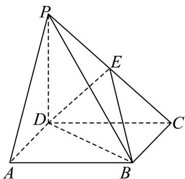

<!-- question-source:start -->
18. (17 分)

如图，四棱锥 $P - ABCD$ 中， $PD \perp$ 平面 $ABCD$ ，底面 $ABCD$ 是正方形， $PD = AB = 2$ ， $E$ 为 $PC$ 中点。

(1)求证： $PA \parallel$ 平面 BDE；

(2)求证： $DE \perp$ 平面PCB；

(3)设平面 $PAB \cap$ 平面 PCD = l ，求证： $l //$ 平面 ABCD .
<!-- question-source:end -->

![[高中/课堂同步/题库/人教A版高中数学同步讲义(2026)/02_必修第二册/期中专项训练+期中模拟卷/高一数学下学期期中模拟卷（人教A版必修第二册第六章~第八章，高效培优·提升卷）/三_填空题/questions/answers/Q00077618A1.md]]
