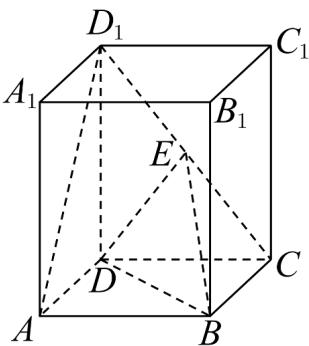

<!-- question-source:start -->
19. (17 分)

已知在正四棱柱 $ABCD - A_{1}B_{1}C_{1}D_{1}$ 中，AD = 3， $AA_{1} = 4$ ，点 E 是 $CD_{1}$ 的中点.

(1)求证： $AD_{1}$ // 平面 EBD；

(2)求异面直线 $AD_{1}$ 与 $DE$ 所成角的余弦值；

(3)求三棱锥 $D_{1}-EBD$ 的体积.
<!-- question-source:end -->

![[高中/课堂同步/题库/人教A版高中数学同步讲义(2026)/02_必修第二册/期中专项训练+期中模拟卷/高一数学下学期期中模拟卷（人教A版必修第二册第六章~第八章，高效培优·提升卷）/三_填空题/questions/answers/Q00077619A1.md]]
