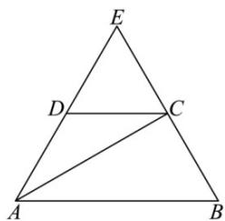
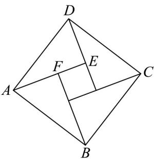

> [!faq]- 《高一数学下学期期中模拟卷（人教A版必修第二册第六章~第八章，高效培优·提升卷）》官方解析
>
> > [!success]- **【答案】** $\frac{\sqrt{3}}{12} / \frac{1}{12}\sqrt{3}$
>
> > [!note]- **【解析】**
> > 在图1中，延长AD、BC于点E，如下图所示：
> >
> > 
> >
> > 因为 $CD // AB$ ，且 $CD = \frac{1}{2} AB$ ，所以， $\frac{DE}{AE} = \frac{CE}{BE} = \frac{CD}{AB} = \frac{1}{2}$
> >
> > 即 $DE = \frac{1}{2} AE$ ， $CE = \frac{1}{2} BE$ ，所以， $AE = 2AD = 2$ ， $BE = 2BC = 2$
> >
> > 所以， $\triangle ABE$ 是边长为 2 的等边三角形，
> >
> > 所以，D、C 分别为 AE、BE 的中点，所以， $BC \perp AC$ ，
> >
> > 所以， $AC=\sqrt{AB^{2}-BC^{2}}=\sqrt{2^{2}-1^{2}}=\sqrt{3}$
> >
> > 易知 $\angle ADC = 120^{\circ}$ ，所以， $S_{\triangle ACD} = \frac{1}{2} AD\cdot CD\sin 120^{\circ} = \frac{1}{2}\times 1^{2}\times \frac{\sqrt{3}}{2} = \frac{\sqrt{3}}{4}$
> >
> > 翻折后，当平面 $ABC \perp$ 平面 ACP 时，点 B 到平面 ACP 的距离取最大值，
> >
> > 因为平面 $ABC \perp$ 平面 ACP ，平面 $ABC \cap$ 平面 ACP = AC ，
> >
> > $BC \subset$ 平面 ABC, $BC \perp AC$
> >
> > 所以， $BC \perp$ 平面 ACP ，
> >
> > 所以， $P - ACD$ 的体积的最大值为 $V_{P - ACB} = V_{B - ACP} = \frac{1}{3} S_{\triangle ACP}\cdot BC = \frac{1}{3}\times \frac{\sqrt{3}}{4}\times 1 = \frac{\sqrt{3}}{12}$
> >
> > 故答案为： $\frac{\sqrt{3}}{12}$
> >
> > 14. 我国汉代数学家赵爽为了证明勾股定理，创制了一幅“弦图”，后人称为“赵爽弦图”，它是由四个全等的直角三角形与一个小正方形拼成的一个大正方形，如图所示．若 $\left|AB\right|=2\sqrt{5}$ ， $\frac{AF}{2}=\frac{1}{2}AE$ ，则向量DC在 $\frac{BF}{DF}$ 上的投影向量的模为\_\_\_\_；设 $\frac{DA=a}{DC=b}$ ，若 $\frac{AE}{AE}=\lambda a+\mu b$ ，则 $\lambda+\mu=$ \_\_\_\_．
> >
> > 
> >
> > 【答案】4 $-\frac{2}{5} / -0.4$
> >
> > 【详解】由题意，设 $EF = x$ ，则 $AE = 2x$ ， $DE = x$
> >
> > 由 $AD^{2}=AE^{2}+DE^{2}$ ，则 $\left(2\sqrt{5}\right)^{2}=\left(2x\right)^{2}+x^{2}$ ，解得 x=2，
> >
> > 因为 $DC = AB$ ，所以向量 $DC$ 在 $BF$ 上的投影向量即为 $AB$ 在 $BF$ 上的投影向量，即为 $FB$
> >
> > 则 $\stackrel{\mathrm{uu}}{DC}$ 在 $\stackrel{\mathrm{uu}}{BF}$ 上的投影向量的模为 $\left|\stackrel{\mathrm{uu}}{FB}\right| = 2x = 4$
> >
> > $$
> > A E = D E - D A = \frac {1}{2} F B - D A = \frac {1}{2} \left(A B - A F\right) - D A
> > $$
> >
> > $$
> > = \frac {1}{2} \left(\frac {\square \square \square}{D C} - \frac {1}{2} \frac {\square \square \square}{A E}\right) - \frac {\square \square \square}{D A} = \frac {1}{2} \frac {\square \square \square}{D C} - \frac {\square \square \square}{D A} - \frac {1}{4} \frac {\square \square \square}{A E}
> > $$
> >
> > 则 $AE = \frac{2}{5} DC - \frac{4}{5} DA = \frac{2}{5} b - \frac{4}{5} a$
> >
> > 所以 $\lambda = -\frac{4}{5}, \mu = \frac{2}{5}$ ，则 $\lambda + \mu = -\frac{4}{5} + \frac{2}{5} = -\frac{2}{5}$ .
> >
> > 故答案为：4； $-\frac{2}{5}$
> >
> > 四、解答题：本题共5小题，共77分。解答应写出文字说明、证明过程或演算步骤。
