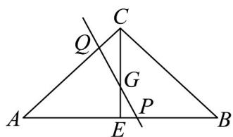

> [!faq]- 《高一数学下学期期中模拟卷（人教A版必修第二册第六章~第八章，高效培优·提升卷）》官方解析
>
> > [!success]- **【答案】** (1)当 $k=\frac{10}{13}$ 时， $AC+2AB$ 与 $kAC-AB$ 垂直. (2) $\frac{4}{3}$ (3) $4\sqrt{2}$
>
> > [!note]- **【解析】**
> > （1）因为 $CA = CB = 3$ ， $\cos \angle CAB = \frac{1}{3}$
> >
> > 所以由余弦定理得 $CB^{2} = AC^{2} + AB^{2} - 2AC\cdot AB\cos \angle CAB$
> >
> > 即 $AB^{2} - 2AB = 0$ ，所以 $AB = 2$
> >
> > 若 $AC + 2AB$ 与 $kAC - AB$ 垂直，则 $\left( \begin{array}{c} \overline{\mathrm{u}}\overline{\mathrm{u}}\overline{\mathrm{u}}\\ AC + 2AB \end{array} \right)\left( kAC - AB \right) = 0$
> >
> > 所以 $kAC^{2} + (2k - 1)AC \cdot AB - 2AB^{2} = 0$
> >
> > 所以 $9k + (2k - 1) \times 2 \times 3 \times \frac{1}{3} - 8 = 0$ ，解得 $k = \frac{10}{13}$ ，
> >
> > 即 $k=\frac{10}{13}$ 时， $AC+2AB$ 与 $kAC-AB$ 垂直.
> >
> > (2)
> >
> > 
> >
> > 因为 $G$ 为 $\mathrm{V}ABC$ 的重心，所以 $\overline{AG} = \frac{2}{3}\times \frac{1}{2}\left(\overline{AB} +\overline{AC}\right) = \frac{1}{3}\overline{AB} +\frac{1}{3}\overline{AC}$
> >
> > 又因为 $AP = \lambda AB$ ， $AQ = \mu AC$ ，所以
> >
> > 由于 $P, G, Q$ 三点共线，所以存在实数 $t$ 使得 $PG = tPQ$
> >
> > 所以 $AG - AP = t\left(AQ - AP\right)$
> >
> > 化简为 $AG = (1 - t)AP + tAQ$ ，所以 $\frac{1}{3\lambda} + \frac{1}{3\mu} = 1$ ，所以 $\frac{1}{\lambda} + \frac{1}{\mu} = 3$
> >
> > 显然 $\lambda > 0, \mu > 0$ ，则 $\lambda + \mu = \frac{1}{3} (\lambda + \mu) \left( \frac{1}{\lambda} + \frac{1}{\mu} \right) = \frac{1}{3} \left( 2 + \frac{\mu}{\lambda} + \frac{\lambda}{\mu} \right) = \frac{4}{3}$
> >
> > 当且仅当 $\frac{\mu}{\lambda} = \frac{\lambda}{\mu}$ 时，即 $\lambda = \mu = \frac{2}{3}$ 时，取“等号”.
> >
> > 则 $\lambda +\mu$ 的最小值为 $\frac{4}{3}$
> >
> > （3）设 $\left|AB\right| = m$ ， $\underset {AB,AC}{\underset{|}{\underset{|}{\underset{|}{\underset{|}{\underset{|}{\underset{|}{\underset{|}{\underset{|}{\underset{|}{\underset{|}{\underset{|}{\underset{|}{\underset{|}{\underset{|}{\underset{|}{\underset{|}{\underset{|}{\underset{|}{\underset{|}{\underset{|}{\underset {|}{\underset{|}{\underset{|}{\underset{|}{\underset{|}{\underset{|}{\underset{|}{\underset{|}{\underset{|}{\underset{|}{\underset{|}{\underset{|}{\underset{|}{\underset{|}{\underset{|}{\underset{|}{\underset{|}{\underset{|}{\underset{|}{\underset{|}{\underset>|{\underset |{\underset |{\underset |{\underset |{\underset |{\underset |{\underset |{\underset |{\underset |{\underset |{\underset |{\underset |{\underset |{\underset |{\underset |{\underset |{\underset |{\underset |{\underset |{\underset |{\underset |{\underset |{\underset |{\underset |{\underset |{\underset ||}}}}}}}}}}}}}}}}{m}}{m}}{m}$ 的夹角为 $\theta$ ，在 $\mathrm{VABC}$ 中， $\cos \theta = \frac{\frac{1}{2}\left|\frac{\overrightarrow{AB}}{\overrightarrow{AB}}\right|}{|\overrightarrow{AC}|}$
> >
> > 所以 $\overrightarrow{AB} \cdot \overrightarrow{AC} = \left| \overrightarrow{AB} \right| \left| \overrightarrow{AC} \right| \cos \theta = \left| \overrightarrow{AB} \right| \left| \overrightarrow{AC} \right| \cdot \frac{\frac{1}{2} \left| \overrightarrow{AB} \right|}{\left| AC \right|} = \frac{1}{2} \left| \overrightarrow{AB} \right|^2$
> >
> > $$
> > \text {又} \left| A C + t A B \right| = \sqrt {\left| A C + t A B \right| ^ {2}} = \sqrt {A C ^ {2} + 2 t A B \cdot A C + t ^ {2} A B ^ {2}} = \sqrt {9 + t A B ^ {2} + t ^ {2} A B ^ {2}}
> > $$
> >
> > $$
> > = \sqrt {9 + t m ^ {2} + t ^ {2} m ^ {2}} = \sqrt {m ^ {2} \left(t + \frac {1}{2}\right) ^ {2} + 9 - \frac {m ^ {2}}{4}}
> > $$
> >
> > 所以当且仅当 $t = \frac{1}{2}$ 时， $\left|AC + tAB\right|$ 取最小值 $\sqrt{9 - \frac{m^2}{4}}$ ，所以 $\sqrt{9 - \frac{m^2}{4}} = 1$
> >
> > 解得 $m = 4\sqrt{2}$ ，即 $\left|\overline{A} C + t\overline{A} B\right|$ 取最小值1时， $\left|\overline{A} B\right| = 4\sqrt{2}$
