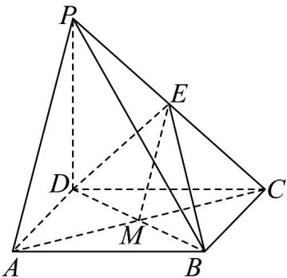

> [!faq]- 《高一数学下学期期中模拟卷（人教A版必修第二册第六章~第八章，高效培优·提升卷）》官方解析
>
> > [!success]- **【答案】** (1)证明见解析 (2)证明见解析 (3)证明见解析
>
> > [!note]- **【解析】**
> > （1）连接 $AC$ ，交 $BD$ 于 $M$ ，如下图所示：
> >
> > 
> >
> > 因为底面 ABCD 是正方形，故 M 为 AC 的中点，所以 ME // PA
> >
> > 又因为 $EM \subset$ 平面 BDE， $AP \not\subset$ 平面 BDE，
> >
> > 所以 $AP \parallel$ 平面 $BDE$ ；
> >
> > (2)∵PD⊥平面ABCD，BC⊂平面ABCD∴PD⊥BC，
> >
> > 又∵在正方形ABCD中， $CD \perp BC$
> >
> > $PD \cap CD = D$ ， $PD$ ， $CD \subset PCD$ 平面
> >
> > $\therefore BC \perp$ 平面 PCD ，
> >
> > 又∵ $DE\subset$ 平面PCD，∴ $BC\perp DE$
> >
> > ∵PD = CD ， E 为 PC 中点，故 DE ⊥ PC ，
> >
> > 又 $PC \cap BC = C$ ，且 $PC \subset$ 平面 $PCB$ ， $BC \subset$ 平面 $PCB$
> >
> > $\therefore DE \perp$ 平面 PCB
> >
> > (3) 在正方形 ABCD 中，有 $AB \parallel CD$ ，
> >
> > 因为 $AB \not\subset$ 平面 PCD ， $CD \subset$ 平面 PCD ，
> >
> > 所以 AB // 平面 PCD，
> >
> > 又因为 $AB \subset$ 面 PAB ，平面 $PAB \cap$ 平面 PCD = l ，所以 $AB // l$
> >
> > 又因为 $l \notin$ 平面 ABCD ， $AB \subset$ 平面 ABCD ，
> >
> > 所以 $l / /$ 平面ABCD.
