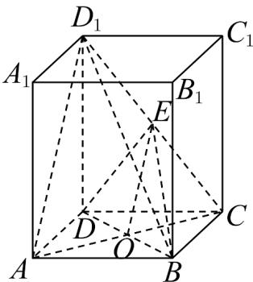

> [!faq]- 《高一数学下学期期中模拟卷（人教A版必修第二册第六章~第八章，高效培优·提升卷）》官方解析
>
> > [!success]- **【答案】** (1)证明见解析 (2) $\frac{16}{25}$ (3) $^{3}$
>
> > [!note]- **【解析】**
> > （1）连接 AC，交 BD 于点 O，则 O 为 AC 的中点，
> >
> > 
> >
> > 又因为 $E$ 为 $CD_{1}$ 的中点，连接 $OE$ ，则 $OE \parallel AD_{1}$
> >
> > ∵ $AD_{1} \not\subset$ 平面 EBD， $OE \subset$ 平面 EBD，
> >
> > $\therefore AD_{1} //$ 平面 EBD ;
> >
> > (2) 由 (1) 知， $OE \parallel AD_{1}$
> >
> > 所以 $\angle DEO$ 为异面直线 $AD_{1}$ 与 DE 所成角或其补角，
> >
> > 正四棱柱 $ABCD-A_{1}B_{1}C_{1}D_{1}$ 中，AD=3，
> >
> > 由勾股定理得 $DB = \sqrt{AD^2 + DB^2} = 3\sqrt{2}$ ， $AD_{1} = \sqrt{AD^{2} + D_{1}D^{2}} = 5$
> >
> > $$
> > C D _ {1} = \sqrt {C D ^ {2} + D _ {1} D ^ {2}} = 5
> > $$
> >
> > 在 $\triangle DEO$ 中， $DO = \frac{1}{2} DB = \frac{3\sqrt{2}}{2}$ ， $OE = \frac{1}{2} AD_{1} = \frac{5}{2}$ ， $DE = \frac{1}{2} CD_{1} = \frac{5}{2}$
> >
> > 由余弦定理，得 $\cos\angle DEO=\frac{DE^{2}+OE^{2}-OD^{2}}{2DE\cdot OE}=\frac{\frac{25}{4}+\frac{25}{4}-\frac{18}{4}}{2\times\frac{5}{2}\times\frac{5}{2}}=\frac{16}{25}$
> >
> > 故异面直线 $AD_{1}$ 与 DE 所成角的余弦值为 $\frac{16}{25}$ ;
> >
> > (3) 因为正方形 ABCD，所以 $CO \perp BD$ ， $CO = \frac{1}{2} BD = \frac{3\sqrt{2}}{2}$
> >
> > 又在正四棱柱 $ABCD-A_{1}B_{1}C_{1}D_{1}$ 中， $DD_{1}\perp$ 平面 ABCD，
> >
> > 因为 $CO \subset$ 平面 ABCD ，所以 $DD_{1} \perp CO$
> >
> > 因为 $DD_{1}\mathrm{I}BD = D$ ， $DD_{1}$ ， $BD\subset$ 平面 $D_{1}DB$ ，所以 $CO\bot$ 平面 $D_{1}DB$
> >
> > $$
> > V _ {D _ {1} - E B D} = V _ {E - B D D _ {1}} = \frac {1}{2} V _ {C - B D D _ {1}} = \frac {1}{2} \times \frac {1}{3} S _ {\triangle B D D _ {1}} \cdot C O = \frac {1}{6} \times \frac {1}{2} \times 3 \sqrt {2} \times 4 \times \frac {3 \sqrt {2}}{2} = 3
> > $$
> >
> > $$
> > \text {或} V _ {D _ {1} - E B D} = V _ {C - B D E} = V _ {E - B D C} = \frac {1}{3} \times \frac {1}{2} S _ {\triangle B D C} \cdot \frac {1}{2} C C _ {1} = \frac {1}{3} \times \frac {1}{2} \times 3 \times 3 \times 2 = 3
> > $$
