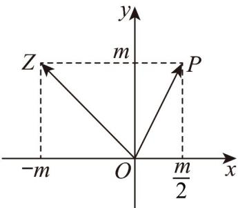

> [!faq]- 《专题02_复数的几何意义五大常考题型_高效培优专项训练_》官方解析
>
> > [!success]- **【答案】**  A. $\left(\frac{1}{5},\frac{2}{5}\right)$ B. $\left(\frac{2}{5},\frac{4}{5}\right)$ C. (6.5) D. $\left(\frac{4}{5},\frac{8}{5}\right)$
>
> > [!note]- **【分析】**
> > 首先根据复数的几何意义设出复数 $z = -m + m\mathrm{i}(m > 0)$ ，再根据复数模的公式，即可求解 $m$ ，再代入向量的投影公式，即可求解。
>
> > [!note]- **【解析】**
> > 由题图可知， $z = -m + m\mathrm{i}(m > 0)$ ，则 $\left|z - \mathrm{i}\right| = \left| - m + (m - 1)\mathrm{i}\right| = \sqrt{m^2 + (m - 1)^2} = 5$
> >
> > $$
> > m = 4 \quad (m = - 3
> > $$
> >
> > 所以 $OZ = (-4, 4)$ ， $OP = (2, 4)$ ，则向量 $\frac{OZ \cdot OP}{OP}$ 上的投影向量为 $\frac{\frac{OZ \cdot OP}{OP}}{|OP|} \cdot \frac{OP}{|OP|}$
> >
> > 所以其坐标为 $\frac{(-4,4)\cdot(2,4)}{\sqrt{2^2+4^2}}\times\frac{(2,4)}{\sqrt{2^2+4^2}}=\frac{8}{\sqrt{20}}\times\frac{(2,4)}{\sqrt{20}}=\left(\frac{4}{5},\frac{8}{5}\right)$
> >
> > 故选 **D**
