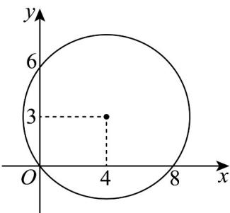

> [!faq]- 《专题02 复数的几何意义五大常考题型（高效培优专项训练）》官方解析
>
> > [!success]- **【答案】** C
>
> > [!note]- **【分析】**
> > 设 $z = x + yi(x, y \in \mathbb{R})$ ，由 z 在复平面上对应的点的轨迹是以 $(4, 3)$ 为圆心，5 为半径的圆，由图即可判断.
>
> > [!note]- **【解析】**
> > 设 $z = x + yi(x, y \in \mathbb{R})$ ，由 $\left|z - 4 - 3\mathrm{i}\right| = 5$ 得 $(x - 4)^{2} + (y - 3)^{2} = 25$ ，
> > 可得 z 在复平面上对应的点的轨迹是以 $(4, 3)$ 为圆心，5 为半径的圆，（如图）.
> >
> > 
> >
> > 由图可知圆 $(x-4)^{2}+(y-3)^{2}=25$ 显然不经过第三象限，
> >
> > 故复数 z 在复平面上不可能位于第三象限.
> >
> > 故选：C.
> >
> > 20. 复数 $z = \mathrm{i}(1 + 3\mathrm{i})$ 在复平面内的对应点位于（ ）A. 第一象限 B. 第二象限 C. 第三象限 D. 第四象限
> >
> > 【答案】B
> >
> > 【分析】计算 $z = \mathrm{i}(1 + 3\mathrm{i})$ ，写出 $z = \mathrm{i}(1 + 3\mathrm{i})$ 的对应点，从而得解
> >
> > 【详解】∵ 复数 $z = \mathrm{i}(1 + 3\mathrm{i}) = -3 + \mathrm{i}$ 在复平面内对应点为 $(-3, 1)$ ，
> > ∴ $z = \mathrm{i}(1 + 3\mathrm{i})$ 在复平面内的对应点位于第二象限，∴选项 B 正确.
> >
> > 故选 **B**.
