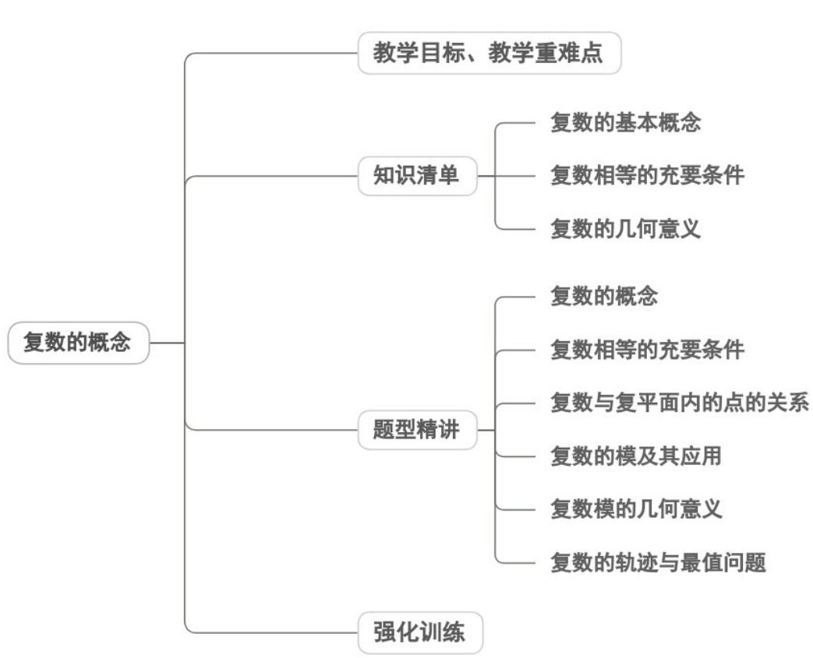
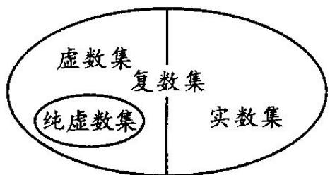
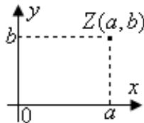

<!-- source-part:1 pages:1-38 -->

专题7.1 复数的概念

## 教学目标、教学重难点

<table><tr><td>教学目标</td><td>1.理解复数的基本概念(虚数单位i、复数、实部、虚部),掌握复数的代数形式 $z=a+bi(a,b\in R)$ ;能区分实数、虚数、纯虚数,掌握其判定条件;理解复数相等的充要条件并能应用求解简单问题。2.虚数单位i的引入及规定( $i^{2}=-1$ ,实数与i的运算律);3.实数、虚数、纯虚数的分类判定条件;4.复数相等充要条件的应用前提(必须将复数化为标准代数形式,且 $a,b,c,d\in R$ );</td></tr><tr><td>教学重难点</td><td>1.重点复数的代数形式 $z=a+bi(a,b\in R)$ 及实部、虚部的识别;</td></tr></table>

2.难点

纯虚数的判定条件（a=0 且 b≠0），避免忽略 b≠0 的易错点；

## 知识清单

## 知识点 01 复数的基本概念

1、虚数单位 $i$

数 $i$ 叫做虚数单位，它的平方等于-1，即 $i^2 = -1$

知识点诠释：

(1) i 是 -1 的一个平方根，即方程 $x^{2} = -1$ 的一个根，方程 $x^{2} = -1$ 的另一个根是 -i；

(2) $i$ 可与实数进行四则运算，进行四则运算时，原有加、乘运算律仍然成立.

## 2、复数的概念

形如 $a + bi(a, b \in R)$ 的数叫复数，记作： $z = a + bi(a, b \in R)$ ；

其中： $a$ 叫复数的实部， $b$ 叫复数的虚部， $i$ 是虚数单位．全体复数所成的集合叫做复数集，用字母 $C$ 表示.

注意：复数定义中， $a,b\in R$ 容易忽视，但却是列方程求复数的重要依据.

3、复数的分类

对于复数 $z = a + bi (a, b \in R)$

若 $b = 0$ ，则 $a + bi$ 为实数，若 $b \neq 0$ ，则 $a + bi$ 为虚数，若 $a = 0$ 且 $b \neq 0$ ，则 $a + bi$ 为纯虚数.

分类如下：

$$
z = a + b i \boxed {(} a, b \in R \boxed {)} \left\{ \begin{array}{l l} \text {实数} (b = 0) \\ \text {虚数} (b \neq 0) \left\{ \begin{array}{l l} \text {纯虚数} (a = 0) \\ \text {非纯虚数} (a \neq 0) \end{array} \right. \end{array} \right.
$$

用集合表示如下图：

4、复数集与其它数集之间的关系

$N_{\subset}Z_{\subset}Q_{\subset}R_{\subset}C$ （其中 $N$ 为自然数集， $Z$ 为整数集， $Q$ 为有理数集， $R$ 为实数集， $C$ 为复数集．）

5、共轭复数：

当两个复数的实部相等，虚部互为相反数时，这两个复数叫做互为共轭复数。虚部不等于0的两个共轭复数

也叫做共轭虚数．通常记复数 z 的共轭复数为 z

【即学即练】

1. 已知复数 $z = x + 5 + (x - 3)\mathrm{i}$ ， $x \in \mathbf{R}$

(1)若 $z$ 为实数，求 $x$ 的值；

(2)若 $z$ 为虚数，求 $x$ 的取值范围；

(3)若 $z$ 为纯虚数，求 $x$ 的值.

【答案】(1) $x = 3$

$$
(- \infty , 3) \cup (3, + \infty) \tag {2}
$$

(3) $x = -5$

【分析】（1）（2）（3）利用复数有相关概念列式求解·

【详解】（1）由z为实数，得x-3=0，所以x=3.

(2) 由 z 为虚数，得 $x - 3 \neq 0$ ，解得 $x \neq 3$ ，

所以 $x$ 的取值范围为 $(- \infty, 3) \cup (3, +\infty)$ .

(3) 由 z 为纯虚数，得 $x + 5 = 0$ 且 $x - 3 \neq 0$ ，所以 x = -5。

2. 下列命题错误的是（ ）

【答案】
A．若a>b，则 $a+i>b+i$ B． $-i^{2}=-1$ C. $(a^{2}+1)\mathrm{i}(a\in\mathbf{R})$ 是纯虚数 D．若 $z\in C$ ，则 $z^{2}>0$

【答案】ABD

【分析】利用复数不等比大小可判断 $^{A}$ 选项；利用虚数单位的性质可判断 $^{B}$ 选项；利用纯虚数的概念可判断

C 选项；取 z = i 可判断 D 选项.

【详解】对于 $^{A}$ 选项，复数不能比大小，故 $^{A}$ 错误；

对于 $^{B}$ 选项，因为 $i^{2}=-1$ ，故 $-i^{2}=1$ ，故 $^{B}$ 错误；

对于 C 选项，因为 $a^{2}+1\quad1$ ，所以 $(a^{2}+1)\mathrm{i}(a\in\mathbb{R})$ 是纯虚数，故 C 正确；

对于 D 选项，当 z = i 时， $z^{2} = i^{2} = -1 < 0$ ，故 D 错误。

故选：ABD.

## 知识点 02 复数相等的充要条件

两个复数相等的定义：如果两个复数的实部和虚部分别相等，那么我们就说这两个复数相等．即：

如果 $a,b,c,d\in R$ $\overline{\text{，那么}}$ $a + bi = c + di\Leftrightarrow \left\{ \begin{array}{l}a = c\\ b = d \end{array} \right.$

特别地： $a + bi = 0 \Leftrightarrow a = b = 0$

知识点诠释：

(1) 一个复数一旦实部、虚部确定，那么这个复数就唯一确定；反之一样。

根据复数 $a + bi$ 与 $c + di$ 相等的定义，可知在 $a = c, b = d$ 两式中，只要有一个不成立，那么就有 $a + bi \neq c + di$

( a , b,c,d∈R ) .

(2) 一般地，两个复数只能说相等或不相等，而不能比较大小如果两个复数都是实数，就可以比较大小；也

只有当两个复数全是实数时才能比较大小.

【即学即练】

1．已知复数 $z_{1} = 4 - m^{2} + mi(m\in R),z_{2} = t + 2\cos \theta +\mathrm{i}\sqrt{3}\sin \theta (t,\theta \in R)$ ，若 $z_{1} = z_{2}$ ，则实数 $t$ 的取值范围为

【答案】 $\left[\frac{2}{3},6\right]$ ;

【分析】利用复数相等的概念结合二次函数和三角函数的有界性求解即可·

【详解】因为 $z_{1} = z_{2}$

所以 $4 - m^{2} + mi = t + 2\cos\theta + i\sqrt{3}\sin\theta,$

所以 $\left\{\begin{aligned}4-m^{2}&=t+2\cos\theta\\ m&=\sqrt{3}\sin\theta\end{aligned}\right.$

所以 $t = 4 - 3 \sin^{2} \theta - 2 \cos \theta,$

又因为 $\sin^{2}\theta + \cos^{2}\theta = 1,$

所以 $t = 4 - 3 \left(1 - \cos^{2} \theta\right) - 2 \cos \theta,$

即 $t = 3\cos^2\theta -2\cos \theta +1,$

令 $\cos \theta = m, m \in [-1, 1]$ ,

则 $t = 3m^{2} - 2m + 1,$

由二次函数的性质知：

该函数对称轴为： $m=-\frac{-2}{2\times3}=\frac{1}{3}$

所以当 m = -1 时，该函数取最大值为 6，

当 $m=\frac{1}{3}$ 时，该函数取最小值 $\frac{2}{3}$ .

故答案为： $\left[\frac{2}{3},6\right]$

2. 已知复数 $z$ 满足 $\left|z\right| = 1$ ，则 $\left|z + \mathrm{i}z + 1\right|$ 的最小值为 \_\_\_\_.

【答案】 $\sqrt{2} - 1 / -1 + \sqrt{2}$

【分析】先由复数几何意义得复数 z 所表示的点 Z 在圆 $x^{2} + y^{2} = 1$ 上，再由复数的模长公式结合两点间距离公

式得到 $\left(x+\frac{1}{2}\right)^{2}+\left(y-\frac{1}{2}\right)^{2}$ 取得最小值时 $\left|z+iz+1\right|$ 取得最小值即可求解.

【详解】设 $z = x + yi(x, y \in \mathbb{R})$ ，则 $x^{2} + y^{2} = 1$ ，所以复数 z 所表示的点 Z 在圆 $x^{2} + y^{2} = 1$ 上，

$$
\left| z + \mathrm{i} z + 1 \right| = \left| (x - y + 1) + (x + y) \mathrm{i} \right| = \sqrt {(x - y + 1) ^ {2} + (x + y) ^ {2}} = \sqrt {2 \left[ \left(x + \frac {1}{2}\right) ^ {2} + \left(y - \frac {1}{2}\right) ^ {2} \right]}
$$

$\left(x + \frac{1}{2}\right)^2 +\left(y - \frac{1}{2}\right)^2$ 表示圆上的点 $Z(x,y)$ 与定点 $\left(-\frac{1}{2},\frac{1}{2}\right)$ 距离 $d$ 的平方，

当该距离平方取得最小值时， $|z + \mathrm{i}z + 1|$ 取得最小值，

而该距离 $d$ 的平方的最小值为 $\left(1 - \sqrt{\left(0 + \frac{1}{2}\right)^2 + \left(0 - \frac{1}{2}\right)^2}\right)^2 = \frac{3}{2} -\sqrt{2}$

所以 $\left|z+i z+1\right|$ 的最小值为 $\sqrt{2\times\left(\frac{3}{2}-\sqrt{2}\right)}=\sqrt{3-2\sqrt{2}}=\sqrt{2}-1$

故答案为： $\sqrt{2} -1$

## 知识点 03 复数的几何意义

1、复平面、实轴、虚轴：

如图所示，复数 $z = a + bi(a,b\in R)$ 可用点 $Z(a,b)$ 表示，这个建立了直角坐标系来表示复数的平面叫做复平面，

也叫高斯平面， $x$ 轴叫做实轴， $y$ 轴叫做虚轴

知识点诠释：实轴上的点都表示实数．除了原点外，虚轴上的点都表示纯虚数．

2、复数集与复平面内点的对应关系

按照复数的几何表示法，每一个复数有复平面内唯一的一个点和它对应；反过来，复平面内的每一个点，有

唯一的一个复数和它对应.

复数集 $C$ 和复平面内所有的点所成的集合是一一对应关系，即

$$
\boxed {\text {复数}} z = a + b i \xleftarrow {- - \text {对应}} \boxed {\text {复平面内的点}} Z (a, b)
$$

这是复数的一种几何意义.

3、复数集与复平面中的向量的对应关系

在平面直角坐标系中，每一个平面向量都可以用一个有序实数对来表示，而有序实数对与复数是一一对应的，

所以，我们还可以用向量来表示复数。

设复平面内的点 $Z(a,b)$ 表示复数 $z = a + bi$ $(a,b\in R)$ ，向量 $\stackrel{\mathrm{UUU}}{OZ}$ 由点 $Z(a,b)$ 唯一确定；反过来，点 $Z(a,b)$ 也

可以由向量 $^{OZ}$ 唯一确定.

复数集 $C$ 和复平面内的向量 $\overline{OZ}$ 所成的集合是一一对应的，即

$$
\boxed {\text {复数}} z = a + b i \xleftarrow {\text {一一对应}} \boxed {\text {平面向量}} \overrightarrow {O Z}
$$

这是复数的另一种几何意义.

4、复数的模

设 $OZ = a + bi (a, b \in R)$ ，则向量 $OZ$ 的长度叫做复数 $z = a + bi$ 的模，记作 $|a + bi|$ . $|z|=|OZ|=\sqrt{a^{2}+b^{2}}\quad0$

知识点诠释：

①两个复数不全是实数时不能比较大小，但它们的模可以比较大小。

② 复平面内，表示两个共轭复数的点关于 $x$ 轴对称，并且他们的模相等。

## 【即学即练】

1. 在复平面内，复数 $1+2i$ ， $\sqrt{2}+\sqrt{3}i$ ， $\sqrt{3}-\sqrt{2}i$ ， $a+i$ 对应的点 $Z_{1}$ ， $Z_{2}$ ， $Z_{3}$ ， $Z_{4}$ 在同一个圆周上，则实数
a = ( ) .
A.-2 B.-1 C.-1或2 D.-2或2

【答案】D

【分析】由题意得点 $Z_{1}$ ， $Z_{2}$ ， $Z_{3}$ ， $Z_{4}$ 在以原点为圆心、半径为 $\sqrt{5}$ 的圆上，进一步列方程即可求解。
【详解】在复平面内与题中所给四个复数对应的点依次为 $Z_{1}(1,2), Z_{2}(\sqrt{2},\sqrt{3}), Z_{3}(\sqrt{3}, -\sqrt{2}), Z_{4}(a,1)$ ，得到对应的以原点为始点的向量依次为 $\overline{OZ_1}, \overline{OZ_2}, \overline{OZ_3}, \overline{OZ_4}$ ，则 $\overline{OZ_1} = (1,2), \overline{OZ_2} = (\sqrt{2},\sqrt{3}), \overline{OZ_3} = (\sqrt{3}, -\sqrt{2}), \overline{OZ_4} = (a,1)$ ，可得 $|\overline{OZ_1}| = \sqrt{1^2 + 2^2} = \sqrt{5}$ ，同理可得 $|\overline{OZ_2}| = \sqrt{5}, |\overline{OZ_3}| = \sqrt{5}$

因为复数 $1 + 2\mathrm{i}$ ， $\sqrt{2} +\sqrt{3}\mathrm{i}$ ， $\sqrt{3} -\sqrt{2}\mathrm{i}$ ， $a + \mathrm{i}$ 对应的点 $Z_{1}$ ， $Z_{2}$ ， $Z_{3}$ ， $Z_{4}$ 在同一个圆周上，所以这些点都在以原点为圆心、半径为 $\sqrt{5}$ 的圆上，

所以 $a^{2}+1=5$ ，解得 $a=\pm2$ ·故选：D.

2. 已知 $z \in \mathbf{C}$ ，则下列说法中与“ $z$ 是纯虚数”不等价的是（ ）A. $z + \overline{z} = 0$ B. $z^2 < 0$ C. $\operatorname{Re} z = 0$ 且 $\operatorname{Im} z \neq 0$ D. $z = |z|\mathrm{i}$ 或 $z = -|z|\mathrm{i}$ ，且 $z \neq 0$

【答案】A

【分析】利用复数的基本概念依次判断即可·

【详解】对于选项 A，设 $z = a + bi$ ， $a, b \hat{l} R$ ，

由 $z + \bar{z} = 0$ 可知，2a = 0 ，即 a = 0 ，

但是不能说明 b 一定不等于零，所以不能说明 z 是纯虚数；

对于选项 B，设 $z = a + bi$ ， $a, b \hat{1} R$ ，

由 $z^2 = a^2 - b^2 + 2ab\mathrm{i} < 0$ 可知 $\left\{ \begin{array}{l}a^2 - b^2 < 0\\ 2ab = 0 \end{array} \right.$ ，即 $a = 0$ ， $b\neq 0$ ，所以可知 $z$ 是纯虚数；

对于选项 C，复数实部为 0，虚部不等于 0，所以可知 z 是纯虚数；

对于选项D，设 $z = a + b\mathrm{i}$ ， $a,b\hat{\mathbf{I}}\mathbf{R}$ ，由 $z = |z|\mathrm{i}$ 可知， $a + b\mathrm{i} = \sqrt{a^2 + b^2}\mathrm{i}$ ，则 $a = 0$

又因为 $z \neq 0$ ，所以 $b \neq 0$ ，同理 $z = -|z|\mathrm{i}$ 且 $z \neq 0$ ，可知 $a = 0$ ， $b \neq 0$ ，所以可知 $z$ 是纯虚数；

故选：A.

## 题型精讲

![[高中/课堂同步/题库/人教A版高中数学同步讲义(2026)/02_必修第二册/第七章 复数/专题7.1 复数的概念（高效培优讲义）/题型01_复数的概念/题型01_复数的概念.md]]
![[高中/课堂同步/题库/人教A版高中数学同步讲义(2026)/02_必修第二册/第七章 复数/专题7.1 复数的概念（高效培优讲义）/题型02_复数相等的充要条件/题型02_复数相等的充要条件.md]]
![[高中/课堂同步/题库/人教A版高中数学同步讲义(2026)/02_必修第二册/第七章 复数/专题7.1 复数的概念（高效培优讲义）/题型03_复数与复平面内的点的关系/题型03_复数与复平面内的点的关系.md]]
![[高中/课堂同步/题库/人教A版高中数学同步讲义(2026)/02_必修第二册/第七章 复数/专题7.1 复数的概念（高效培优讲义）/题型04_复数的模及其应用/题型04_复数的模及其应用.md]]
![[高中/课堂同步/题库/人教A版高中数学同步讲义(2026)/02_必修第二册/第七章 复数/专题7.1 复数的概念（高效培优讲义）/题型05_复数模的几何意义/题型05_复数模的几何意义.md]]
![[高中/课堂同步/题库/人教A版高中数学同步讲义(2026)/02_必修第二册/第七章 复数/专题7.1 复数的概念（高效培优讲义）/题型06_复数的轨迹与最值问题/题型06_复数的轨迹与最值问题.md]]
![[高中/课堂同步/题库/人教A版高中数学同步讲义(2026)/02_必修第二册/第七章 复数/专题7.1 复数的概念（高效培优讲义）/强化训练/强化训练.md]]
