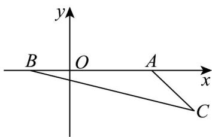

> [!faq]- 《专题7.1 复数的概念（高效培优讲义）》官方解析
>
> > [!success]- **【答案】** A. 复数 $z$ 的实部为 3 B. 复数 $z$ 的共轭复数为 $3 - a\mathrm{i}$ C. $0 \leq |z| < 3$ D. 若 $z$ 为实数，则 $a = 0$
>
> > [!note]- **【分析】**
> > 由复数的概念即可判断 ABD，求复数的模即可判断 C.
>
> > [!note]- **【解析】**
> > $z=3+ai$ ，则实部为 $^{3}$ ，故 $^{A}$ 正确；共轭复数为 $3-ai$ ，故 $^{B}$ 正确；
> >
> > 当 $z$ 为实数时 $a = 0$ ，故 $\mathbb{D}$ 正确； $|z| = \sqrt{9 + a^2} \quad 3$ ，故 $\mathbb{C}$ 错误
> >
> > 故选：ABD
> >
> > $$
> > z _ {1} = 2 + \mathrm{i} \sin 2 \theta
> > $$
> >
> > $$
> > \stackrel {\mathrm{xxxx}} {O Z _ {1}}
> > $$
> >
> > $$
> > z _ {2} = \sin \theta - \cos \theta + \mathrm{i}
> > $$
> >
> > $$
> > \stackrel {{\mathrm{OZ}}} {{=}} _ {2}
> > $$
> >
> > $$
> > 2 \sqrt {2} - 1
> > $$
> >
> > $$
> > O Z _ {1} \cdot O Z _ {2}
> > $$
> >
> > $$
> > \sqrt {2} + 1
> > $$
> >
> > $$
> > 3 \sqrt {2} - 2
> > $$
> >
> > 【答案】D
> >
> > 【分析】根据给定条件，求出 $OZ_{1}, OZ_{2}$ 的坐标，利用数量积的坐标式，结合二倍角的正弦公式及 $\sin \theta \cos \theta$ 与 $\sin \theta - \cos \theta$ 的关系，换元后化成二次函数即可求出最大值·
> > 【详解】依题意， $OZ_{1} = (2, \sin 2\theta), OZ_{2} = (\sin \theta - \cos \theta, 1)$ ，则 $OZ_{1} \cdot OZ_{2} = 2(\sin \theta - \cos \theta) + \sin 2\theta$ ，
> > 令 $\sin \theta - \cos \theta = t$ ，则 $t = \sqrt{2} \sin (\theta - \frac{\pi}{4}) \in [-\sqrt{2}, \sqrt{2}]$ ， $\sin 2\theta = 2\sin \theta \cos \theta = 1 - t^{2}$ ，
> >
> > 因此 $\stackrel{\square\square\square\square}{OZ_{1}}\cdot\stackrel{\square\square\square\square}{OZ_{2}}=2t+1-t^{2}=-(t-1)^{2}+2$ ，则当 t=1 时， $\stackrel{\square\square\square\square\square}{OZ_{1}}\cdot\stackrel{\square\square\square\square\square}{OZ_{2}}$ 取得最大值为 2，
> >
> > 故 $OZ_{1}\cdot OZ_{2}$ 的最大值为 2.
> >
> > 故选：D
> >
> > 5. 如果复数 $z$ 满足 $\left|z - 2\right| + \left|z + 1\right| = 3$ ，那么 $\left|z - 3 + \mathrm{i}\right|$ 的最大值是
> >
> > 【答案】 $\sqrt{17}$
> >
> > 【分析】首先将 $|z - 2| + |z + 1| = 3$ 看作是点 $(x,y)$ 到 $A(2,0),B(-1,0)$ 两点距离之和为3，然后判断点 $(x,y)$ 的轨
> >
> > 迹，然后将 $\left|z-3+i\right|$ 看作是点 $(x,y)$ 到点 $C(3,-1)$ 的距离，最后根据图象即可计算 $\left|z-3+i\right|$ 的最大值.
> >
> > 【详解】复数 $z$ 满足 $\left|z - 2\right| + \left|z + 1\right| = 3$
> >
> > 将其可以看作是点 $(x,y)$ 到 $A(2,0), B(-1,0)$ 两点距离之和为 3.
> >
> > 因为 $\left|AB\right|=2+1=3$ ，所以点 $(x,y)$ 的轨迹为线段 AB·
> >
> > 而 $\left|z-3+i\right|$ 表示的是点 $(x,y)$ 到点 $C(3,-1)$ 的距离，
> >
> > 要求其距离的最大值，则根据图象可知点 $B$ 到点 $C(3, -1)$ 的距离最大，
> >
> > 即 $\left|BC\right|=\sqrt{\left(3+1\right)^{2}+\left(-1-0\right)^{2}}=\sqrt{17}$ .
> >
> > 故答案为： $\sqrt{17}$
> >
> > 
