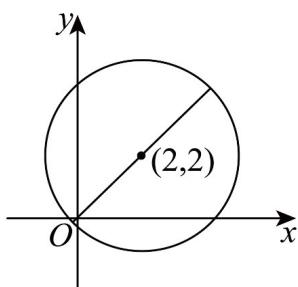

> [!faq]- 《专题7.1 复数的概念（高效培优讲义）》官方解析
>
> > [!success]- **【答案】** $\left[3 - 2\sqrt{2}, 2\sqrt{2} + 3\right]$
>
> > [!note]- **【分析】**
> > 设 $z = x + yi, (x, y \in \mathbb{R})$ ，由已知得 $z$ 在复平面的轨迹是以 $(2, 2)$ 为圆心，3为半径的圆，利用圆心到原
> >
> > 点的距离加减半径可得答案·
>
> > [!note]- **【解析】**
> > 设 $z = x + yi, (x, y \in \mathbb{R})$ ，由 $\left|z - 2 - 2i\right| = 3$ 得 $(x - 2)^{2} + (y - 2)^{2} = 9$
> >
> > 可得 $z$ 在复平面的轨迹是以 $(2,2)$ 为圆心，3为半径的圆，
> >
> > 所以 $3-\sqrt{2^{2}+2^{2}}\leq\left|z\right|\leq\sqrt{2^{2}+2^{2}}+3$ ，即 $3-2\sqrt{2}\leq\left|z\right|\leq2\sqrt{2}+3$ .
> >
> > 故答案为： $\left[3 - 2\sqrt{2},2\sqrt{2} +3\right]$
> >
> > 
> >
> > ## 方法技巧
> >
> > 利用几何意义进行转化。
