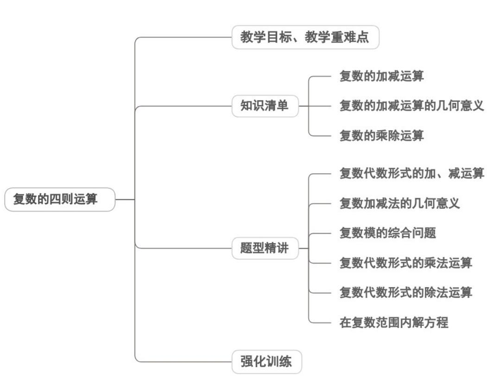
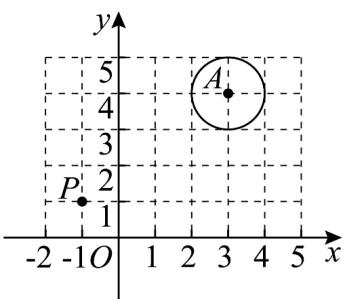
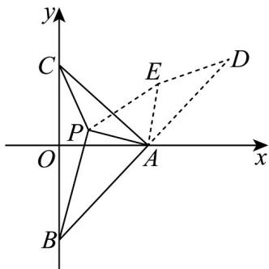

<!-- source-part:1 pages:1-42 -->

## 专题7.2 复数的四则运算

<table><tr><td>教学目标</td><td>1.理解复数的基本概念(虚数单位i、复数、实部、虚部),掌握复数的代数形式 $z=a+bi(a,b\in R)$ ;能区分实数、虚数、纯虚数,掌握其判定条件;理解复数相等的充要条件并能应用求解简单问题。2.虚数单位i的引入及规定( $i^{2}=-1$ ,实数与i的运算律);3.实数、虚数、纯虚数的分类判定条件;4.复数相等充要条件的应用前提(必须将复数化为标准代数形式,且 $a,b,c,d\in R$ );</td></tr><tr><td>教学重难点</td><td>1.重点复数的代数形式 $z=a+bi(a,b\in R)$ 及实部、虚部的识别;</td></tr></table>

纯虚数的判定条件（a=0 且 b≠0），避免忽略 b≠0 的易错点；

## 知识清单

## 知识点 01 复数的加减运算

1、复数的加法、减法运算法则：

设 $z_{1} = a + bi$ ， $z_{2} = c + di$ （ $a,b,c,d\in R$ ），我们规定：

$$
z _ {1} + z _ {2} = (a + b i) + (c + d i) = (a + c) + (b + d) i
$$

$$
z _ {2} - z _ {1} = (c - a) + (d - b) i
$$

知识点诠释：

（1）复数加法中的规定是实部与实部相加，虚部与虚部相加，减法同样．很明显，

两个复数的和（差）仍然是一个复数，复数的加（减）法可以推广到多个复数相加（减）的情形。

(2) 复数的加减法，可模仿多项式的加减法法则计算，不必死记公式。

2、复数的加法运算律：

交换律： $z_{1} + z_{2} = z_{2} + z_{1}$

结合律： $(z_{1} + z_{2}) + z_{3} = z_{1} + (z_{2} + z_{3})$

【即学即练】

1. (1) 化简求值： $z = (1 - 2\mathrm{i}) + (2 + \mathrm{i}) - (3 - 4\mathrm{i})$

(2) $\left(x - 3y\right) + (2x + 3y)\mathrm{i} = 5 + \mathrm{i}$ 求满足上述条件的实数 $x, y$ 的值；

(3) $2x^{2}-5x+3+(y^{2}+y-6)\mathrm{i}=0$ ·求满足上述条件的实数x,y的值·

【答案】（1）3i；（2） $x = 2, y = -1$ ；（3） $x = \frac{3}{2}$ 或1， $y = -3$ 或2.

【分析】（ $^{1}$ ）利用复数加减运算法则计算出答案；

(2) 利用复数相等的条件得到方程组，求出答案；

(3) 利用复数相等的条件得到方程组，求出答案.

【详解】（1） $z = 1 + 2 - 3 - 2\mathrm{i} + \mathrm{i} + 4\mathrm{i} = 3\mathrm{i}$

(2) $(x - 3y) + (2x + 3y)\mathrm{i} = 5 + \mathrm{i}$ ，故 $\left\{ \begin{array}{l}x - 3y = 5\\ 2x + 3y = 1 \end{array} \right.$ ，解得 $\left\{ \begin{array}{l}x = 2\\ y = -1 \end{array} \right.$

(3) $2x^{2} - 5x + 3 + (y^{2} + y - 6)\mathrm{i} = 0$ ，故 $\left\{ \begin{array}{l}2x^{2} - 5x + 3 = 0\\ y^{2} + y - 6 = 0 \end{array} \right.$

解得 $x=\frac{3}{2}$ 或 1，y=-3 或 2.

2. 已知复数 $z_{1}, z_{2}$ 满足 $\left|z_{1}\right| = \left|z_{2}\right| = 5$ ，且 $z_{1} - z_{2} = 3 - 4\mathrm{i}$ ，则 $\left|z_{1} + z_{2}\right| =$ \_\_\_\_.

【答案】 $5 \sqrt{3}$

【分析】先设 $z_{1}=a+bi$ ， $z_{2}=c+di(a,b,c,d\in\mathbf{R})$ 根据给定条件，结合复数相等和复数模公式计算作答.

【详解】设 $z_{1} = a + bi$ ， $z_{2} = c + di(a,b,c,d\in \mathbf{R})$

又 $\left|z_{1}\right|=\left|z_{2}\right|=5$ ，所以 $\sqrt{a^{2}+b^{2}}=5\sqrt{c^{2}+d^{2}}=5$

又 $z_{1} - z_{2} = a - c + (b - d)\mathrm{i} = 3 - 4\mathrm{i}$ ，所以 $a - c = 3$ ， $b - d = -4$

所以 $\left(a - c\right)^2 +\left(b - d\right)^2 = a^2 -2ac + c^2 +b^2 -2bd + d^2 = 50 - 2ac - 2bd = 3^2 +\left(-4\right)^2$

所以 $2ac + 2bd = 25$

$$
\text {以} \left| z _ {1} + z _ {2} \right| = \left| a + c + (b + d) \mathrm{i} \right| = \sqrt {(a + c) ^ {2} + (b + d) ^ {2}} = \sqrt {a ^ {2} + 2 a c + c ^ {2} + b ^ {2} + 2 b d + d ^ {2}} = 5 \sqrt {3}
$$

故答案为： $5\sqrt{3}$

## 知识点 02 复数的加减运算的几何意义

1、复数的表示形式：

代数形式： $z = a + bi$ （ $a, b \in R$ ）

几何表示：

①坐标表示：在复平面内以点 $Z(a,b)$ 表示复数 $z = a + bi$ （ $a,b \in R$ ）；

② 向量表示：以原点 $O$ 为起点，点 $Z(a,b)$ 为终点的向量 $\overline{OZ}$ 表示复数 $z = a + bi$

2、复数加、减法的几何意义：

如果复数 $z_{1}$ 、 $z_{2}$ 分别对应于向量 $\stackrel{\square\square\square}{OP_1}$ 、 $\stackrel{\square\square\square\square}{OP_2}$ ，那么以 $OP_{1}$ 、 $OP_{2}$ 为两边作平行四边形 $OP_{1}SP_{2}$ ，对角线 $OS$ 表示

的向量 $OS$ 就是 $z_{1} + z_{2}$ 的和所对应的向量. 对角线 $P_{2}P_{1}$ 表示的向量 $P_{2}P_{1}$ 就是两个复数的差 $z_{1} - z_{2}$ 所对应的向量.

设复数 $z_{1} = a + bi$ ， $z_{2} = c + di$ ，在复平面上所对应的向量为 $\overline{OZ}_{1}$ 、 $\overline{OZ}_{2}$ ，即 $\overline{OZ}_{1}$ 、 $\overline{OZ}_{2}$ 的坐标形式为

$\overline{OZ}_{1}=(a,b)$ ， $\overline{OZ}_{2}=(c,d)$ 。以 $\overline{OZ}_{1}$ 、 $\overline{OZ}_{2}$ 为邻边作平行四边形 $OZ_{1}ZZ_{2}$ ，则对角线OZ对应的向量是 $\overline{OZ}$

由于 $\overline{OZ}=\overline{OZ_{1}}+\overline{OZ_{2}}=(a,b)+(c,d)=(a+c,b+d)$ ，所以 $\overline{OZ_{1}}$ 和 $\overline{OZ_{2}}$ 的和就是与复数 $(a+c)+(b+d)i$ 对应的向

量.

【即学即练】

1. 设复数 $z$ 满足 $\left|z - 3 - 4\mathrm{i}\right| \leq 1$ ，求：

(1) $\left|z\right|$ 的取值范围；

(2) $\left|z+1-i\right|$ 的最大值.

【答案】(1)[4,6] (2)6

【分析】（1）满足不等式 $|z - 3 - 4\mathrm{i}| \leq 1$ 的复数 $z$ 所对应的点在以 $A(3,4)$ 为圆心，1为半径的圆上及圆内，利用几何图形求解该圆上点到原点距离的范围即为 $|z|$ 的取值范围；

(2) $\left|z+1-\mathrm{i}\right|$ 代表满足已知圆及圆内点到 $P(-1,1)$ 的距离，利用几何图形求解即可·

【详解】（1）满足不等式 $\left|z-3-4\mathrm{i}\right|\leq1$ 的复数z所对应的点在以 $A(3,4)$ 为圆心， $^{1}$ 为半径的圆上及圆内，如图所示·

(1) 解法 $1: |z|$ 代表满足已知圆及圆内点到原点的距离，因此距离最大值为圆心到原点的距离 $^5$ 加半径 $^1$ ，最小值为圆心到原点的距离 $^5$ 减半径 $^1$ ，即 $|z| \in [4,6]$ .

解法2：由不等式 $\left\| z_1\right| - \left|z_2\right|\leq \left|z_1 - z_2\right|\leq \left|z_1\right| + \left|z_2\right|$ ，得 $\left\| z\right| - \left|3 + 4\mathrm{i}\right|\leq \left|z - 3 - 4\mathrm{i}\right|\leq 1$ ，即 $\left\| z\right| - 5\mid \leq 1$ ，解得 $|z|\in [4,6]$

(2) (2) $\left|z+1-i\right|$ 代表满足已知圆及圆内点到 $P(-1,1)$ 的距离，所以点 $A(3,4)$ 到点 $P(-1,1)$ 的距离为 $AP=\sqrt{(3+1)^{2}+(4-1)^{2}}=5$ ，所以 $|z+1-i|\in[4,6]$ ，即最大值为6.

2．已知复数 $z_{1}$ ， $z_{2}$ 满足 $z_{1}=\mathrm{i}z_{2}$ 且 $z_{1}\overline{z_{1}}=1$ ，则对于任意的复数z， $\sqrt{2}|z-z_{1}|+|z-z_{2}|+|z+z_{2}|$ 的最小值为\_\_\_\_。
【答案】 $2\sqrt{2}$

【分析】根据题意可得 $a^{2}+b^{2}=1$ ，简化运算，不妨设 $z_{1}=1,z_{2}=-i$ ，利用复数的几何意义转化为

$\sqrt{2}\left|PA\right| + \left|PB\right| + \left|PC\right|$ ，根据加权费马定理求最小值即可·

【详解】设 $z_{1} = a + bi(a, b \in \mathbb{R})$ ，因为 $z_{1}\overline{z_{1}} = 1$

所以 $z_{1}\overline{z_{1}}=(a+bi)(a-bi)=a^{2}+b^{2}=1$ ， $z_{2}=\frac{z_{1}}{i}=b-ai$ ，

根据对称性，不妨取 $z_{1}=1, z_{2}=-i$ ，

则 $\left|z-z_{1}\right|,\left|z-z_{2}\right|,\left|z+z_{2}\right|$ 的几何意义为复平面中到点 $A(1,0),B(0,-1),C(0,1)$ 的距离，∴ $\sqrt{2}\left|z-z_{1}\right|+\left|z-z_{2}\right|+\left|z+z_{2}\right|=\sqrt{2}\left|PA\right|+\left|PB\right|+\left|PC\right|$

如图，将 $\triangle ACP$ 顺时针旋转 $90^{\circ}$ 得到VADE， $D(2,1)$ ，

则 $AP \perp AE, AP = AE$ ，所以 $PE = \sqrt{2} PA$

又 $\triangle ACP \cong \triangle ADE$ ，所以 PC = ED，

所以 $\sqrt{2}|PA|+|PB|+|PC|=|PE|+|PB|+|ED|\quad|BD|=2\sqrt{2}$

故答案为： $2\sqrt{2}$

## 知识点 03 复数的乘除运算

1、乘法运算法则：

设 $z_{1} = a + bi$ ， $z_{2} = c + di$ （ $a,b,c,d\in R$ ），我们规定：

$$
z _ {1} \cdot z _ {2} = (a + b i) (c + d i) = (a c - b d) + (b c + a d) i
$$

$$
\frac {z _ {1}}{z _ {2}} = \frac {a + b i}{c + d i} = \frac {(a + b i) (c - d i)}{(c + d i) (c - d i)} = = \frac {a c + b d}{c ^ {2} + d ^ {2}} + \frac {b c - a d}{c ^ {2} + d ^ {2}} i
$$

知识点诠释：

(1) 两个复数相乘，类似两个多项式相乘，在所得的结果中把 $i^2$ 换成-1，并且把实部与虚部分别合并。两

个复数的积仍然是一个复数.

（2）在进行复数除法运算时，通常先把除式写成分式的形式，再把分子与分母都乘以分母的共轭复数（分母

实数化），化简后写成代数形式。

2、乘法运算律：

(1) 交换律： $z_{1}(z_{2}z_{3})=(z_{1}z_{2})z_{3}$

(2) 结合律： $z_{1}(z_{2} + z_{3}) = z_{1}z_{2} + z_{1}z_{3}$

(3) 分配律： $z_{1}(z_{2} + z_{3}) = z_{1}z_{2} + z_{1}z_{3}$

## 【即学即练】

1. 已知复数 $z_{1}, z_{2}$ 所对应的向量分别为 $OZ_{1}$ ， $OZ_{2}$ ，其中 $O$ 为坐标原点，则下列说法正确的有（）

【答案】
A. 若 $z_{1} - z_{2} > 0$ ，则 $z_{1} > z_{2}$ B. 若 $\left|z_{1} - z_{2}\right| = \left|z_{1} + z_{2}\right|$ ，则 $z_{1}z_{2} = 0$ C. 若 $\left|z_{1} - z_{2}\right| = 0$ ，则 $OZ_{1} = OZ_{2}$ D. 若 $z_{1}^{2} + z_{2}^{2} = 0$ ，则 $\left|OZ_{1}\right| = \left|OZ_{2}\right|$

【答案】CD

【分析】举例说明 $^{AB}$ 是错误的；根据复数模的概念，判断 $^{C}$ 的真假；利用复数乘法的运算法则，判断 $^{D}$ 的真

假·

【详解】对 A：设 $z_{1}=2+i$ ， $z_{2}=1+i$ ，则 $z_{1}-z_{2}=(2+i)-(1+i)=1>0$ ，但复数 $z_{1}$ ， $z_{2}$ 不能比较大小，故

$z_{1}>z_{2}$ 不成立，所以 A 错误；

对 B：取 $z_{1}=1+i$ ， $z_{2}=1-i$ ，则 $\left|z_{1}+z_{2}\right|=2$ ， $\left|z_{1}-z_{2}\right|=\left|2i\right|=2$ ，但 $z_{1}z_{2}=(1+i)(1-i)=1-i^{2}=1+1=2\neq0$ ，所以

$z_{1}z_{2}=0$ 不成立，所以 B 错误；

对 C：由 $\left|z_{1}-z_{2}\right|=0\Rightarrow z_{1}=z_{2}$ ，所以 $OZ_{1}=OZ_{2}$ ，故 C 正确；

对 D：设 $z_{1}=a+bi,\quad z_{2}=c+di,\quad a,b,c,d\in R$

$$
z _ {1} ^ {2} + z _ {2} ^ {2} = 0 \Rightarrow \left\{ \begin{array}{l} a ^ {2} - b ^ {2} + c ^ {2} - d ^ {2} = 0 \\ a b + c d = 0 \end{array} \right.
$$

由 $ab + cd = 0$ ，当 $c \neq 0$ 时，有 $d = -\frac{ab}{c}$ ，代入 $a^2 - b^2 + c^2 - d^2 = 0$ 得：

$$
a ^ {2} - b ^ {2} + c ^ {2} - \left(\frac {a b}{c}\right) ^ {2} = 0 \Rightarrow a ^ {2} c ^ {2} - b ^ {2} c ^ {2} + c ^ {4} - a ^ {2} b ^ {2} = 0 \Rightarrow c ^ {2} \left(a ^ {2} + c ^ {2}\right) - b ^ {2} \left(c ^ {2} + a ^ {2}\right) = 0 \Rightarrow b ^ {2} = c ^ {2}.
$$

结合 $a^2 - b^2 + c^2 - d^2 = 0 \Rightarrow a^2 = d^2$ ，所以 $a^2 + b^2 = c^2 + d^2$

所以 $\left|z_{1}\right|=\left|z_{2}\right|$ ，所以 $\left|\overline{O}Z_{1}\right|=\left|\overline{O}Z_{2}\right|$ ;

当 c=0 时， $ab=0\Rightarrow a=0$ 或 b=0。

若 $a = 0$ ，则 $b^{2} + d^{2} = 0\Rightarrow b = d = 0$ ，所以 $z_{1} = z_{2} = 0$ ，所以 $\left|z_1\right| = \left|z_2\right|$ ，可得 $\left|\overline{O}\overline{Z}_1\right| = \left|\overline{O}\overline{Z}_2\right|$

若 $b = 0$ ，则 $a^2 - d^2 = 0$ ，因为 $\left|z_1\right| = \left|a\right|$ ， $\left|z_2\right| = \left|d\right|$ ，所以 $\left|z_1\right| = \left|z_2\right|$ ，可得 $\left|\overline{O} Z_1\right| = \left|\overline{O} Z_2\right|$ .

综上可知， $^{D}$ 正确·

故选：CD

2. 若 $\frac{z}{z - 1} = 1 + \mathrm{i}$ ，则 $z$ 的虚部为（ ）A.1 B.-1 C.i D.-i

【答案】B

【分析】利用复数的运算化简等式可得 $z=\frac{1+i}{i}$ ，结合 $-i^{2}=1$ 可得结果·

【详解】因为 $\frac{z}{z - 1} = 1 + \mathrm{i}$ ，所以 $z(1 + \mathrm{i}) - (1 + \mathrm{i}) = z$ ，即 $\mathrm{i}z = 1 + \mathrm{i}$ ，故 $z = \frac{1 + \mathrm{i}}{\mathrm{i}} = \frac{-\mathrm{i}^2 + \mathrm{i}}{\mathrm{i}} = 1 - \mathrm{i}$

所以复数 $z$ 的虚部为 $-1\cdot$

故选：B.

## 题型精讲

![[高中/课堂同步/题库/人教A版高中数学同步讲义(2026)/02_必修第二册/第七章 复数/专题7.2 复数的四则运算（高效培优讲义）/题型01_复数代数形式的加_减运算/题型01_复数代数形式的加_减运算.md]]
![[高中/课堂同步/题库/人教A版高中数学同步讲义(2026)/02_必修第二册/第七章 复数/专题7.2 复数的四则运算（高效培优讲义）/题型02_复数加减法的几何意义/题型02_复数加减法的几何意义.md]]
![[高中/课堂同步/题库/人教A版高中数学同步讲义(2026)/02_必修第二册/第七章 复数/专题7.2 复数的四则运算（高效培优讲义）/题型03_复数模的综合问题/题型03_复数模的综合问题.md]]
![[高中/课堂同步/题库/人教A版高中数学同步讲义(2026)/02_必修第二册/第七章 复数/专题7.2 复数的四则运算（高效培优讲义）/题型04_复数代数形式的乘法运算/题型04_复数代数形式的乘法运算.md]]
![[高中/课堂同步/题库/人教A版高中数学同步讲义(2026)/02_必修第二册/第七章 复数/专题7.2 复数的四则运算（高效培优讲义）/题型05_复数代数形式的除法运算/题型05_复数代数形式的除法运算.md]]
![[高中/课堂同步/题库/人教A版高中数学同步讲义(2026)/02_必修第二册/第七章 复数/专题7.2 复数的四则运算（高效培优讲义）/题型06_在复数范围内解方程/题型06_在复数范围内解方程.md]]
![[高中/课堂同步/题库/人教A版高中数学同步讲义(2026)/02_必修第二册/第七章 复数/专题7.2 复数的四则运算（高效培优讲义）/强化训练/强化训练.md]]
