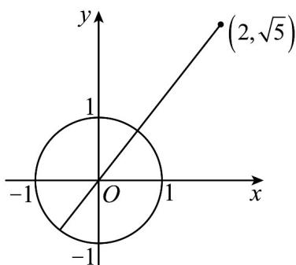

> [!faq]- 《专题7.2 复数的四则运算（高效培优讲义）》官方解析
>
> > [!success]- **【答案】** [2,4]
>
> > [!note]- **【分析】**
> > 根据复数模的几何意义，转化为点 $(2,\sqrt{5})$ 到圆心的距离加半径可得最大值，减半径可得最小值即可·
>
> > [!note]- **【解析】**
> > $|z| = 1$ 表示 $z$ 对应的点是单位圆上的点，
> >
> > $\left|z - 2 - \sqrt{5}\mathrm{i}\right|$ 的几何意义表示单位圆上的点和 $(2,\sqrt{5})$ 之间的距离，
> >
> > $\left|z - 2 - \sqrt{5}\mathrm{i}\right|$ 的取值范围转化为点 $(2,\sqrt{5})$ 到圆心的距离加上半径可得最大值，
> >
> > 减去半径可得最小值，
> >
> > 所以最大距离为 $\sqrt{4+5}+1=4$ ，最小距离为 $\sqrt{4+5}-1=2$ ，
> >
> > 所以 $\left|z-2-\sqrt{5}\mathrm{i}\right|$ 的取值范围为 $[2,4]$ .
> >
> > 故答案为：[2,4].
> >
> > 
