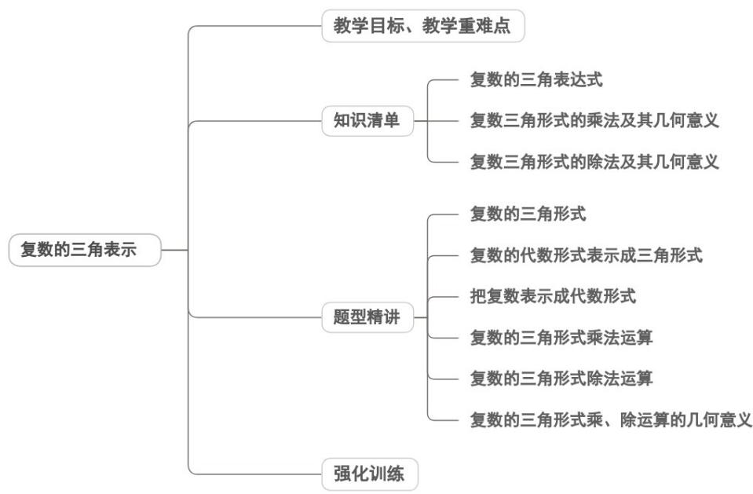

<!-- source-part:1 pages:1-43 -->

专题7.3 复数的三角表示

## 内容概览



## 教学目标、教学重难点

<table><tr><td>教学目标</td><td>1.准确识记复数三角表示的定义,理解其结构特征( $z = r(\cos \theta + i \sin \theta)$ ),明确模r与辐角 $\theta$ 的内涵及取值要求( $r \geqslant 0$ ,辐角的主值范围[0,2π));2.掌握复数代数形式(a+bi)与三角形式的互化公式,能根据已知条件(如实部、虚部或模、辐角)熟练完成双向转换;3.理解复数三角形式下乘、除运算的法则,能借助三角恒等变换推导运算公式,并准确进行计算;4.阐释复数三角表示的几何意义,建立“模对应向量长度、辐角对应向量方向”的直观认知,关联复平面内点、向量与复数的三角形式表征。</td></tr><tr><td>教学重难点</td><td>1.重点复数三角形式的乘、除运算法则及其几何意义(乘法:模相乘、辐角相加;除法:模相</td></tr></table>

```txt
除、辐角相减，对应复平面内向量的伸缩与旋转变换）。
2.难点
数学思想的灵活运用：在复杂问题中，难以主动选择三角形式简化运算（如复数乘方、开方或向量旋转问题），缺乏对不同表示形式适用场景的判断能力。
```

## 知识清单

## 知识点 01 复数的三角表达式

## 1、复数的辐角

以 $x$ 轴的正半轴为始边、向量 $OZ$ 所在的射线为终边的角，叫做复数 $z = a + bi$ 的辐角.

适合于 $0 \leq \theta < 2\pi$ 的辐角 $\theta$ 的值，叫辐角的主值．记作： $\arg z$ ，即 $0 \leq \arg z < 2\pi$ ：

## 2、复数的三角表达式

一般地，任何一个复数 $z = a + bi$ 都可以表示成 $r(\cos \theta + i\sin \theta)$ 的形式。其中， $r$ 是复数的模； $\theta$ 是复数 $z = a + bi$ 的辐角。 $r(\cos \theta + i\sin \theta)$ 叫做复数 $z = a + bi$ 的三角表示式，简称三角形式。为了与三角形式区分开

来 $a + bi$ 叫做复数的代数表示式，简称代数形式.

注意：复数三角形式的特点：模非负，角相同，余弦前，加号连

3、两个用三角形式表示的复数相等的充要条件：

两个非零复数相等当且仅当它们模与辐角的主值分别相等.

【即学即练】

1. 若复数 $z + 1$ 的辐角的主值为 $\frac{\pi}{6}, z - 1$ 的辐角的主值为 $\frac{2\pi}{3}$ ，则 $z$ 的代数形式为 \_\_\_\_.

【答案】 $z = \frac{1}{2} +\frac{\sqrt{3}}{2}\mathrm{i}$

【分析】先设 $z = a + bi (a, b \in \mathbb{R})$ ，再依次根据 $z + 1, z - 1$ 结合其辐角及其定义即可计算求解参数 a, b.

【详解】设 $z = a + bi (a, b \in \mathbb{R})$ ，则 $z + 1 = (a + 1) + bi, z - 1 = (a - 1) + bi,$

因为复数 $z + 1$ 的辐角的主值为 $\frac{\pi}{6}$ ，所以 $\tan \frac{\pi}{6} = \frac{b}{a + 1} = \frac{\sqrt{3}}{3}$ ①，

因为复数 $z - 1$ 的辐角的主值为 $\frac{2\pi}{3}$ ，所以 $\tan \frac{2\pi}{3} = \frac{b}{a - 1} = -\sqrt{3}$ ②，

由①②可得 $a=\frac{1}{2}$ ， $b=\frac{\sqrt{3}}{2}$ ，所以 $z=\frac{1}{2}+\frac{\sqrt{3}}{2}i$ 。故答案为： $z=\frac{1}{2}+\frac{\sqrt{3}}{2}i$ 。

2．任何一个复数 $z$ 都可以表示为 $r\mathrm{e}^{\mathrm{i}\theta}$ ，且可以表示为三角形式 $r(\cos \theta +\mathrm{i}\sin \theta),r$ 代表复数 $z$ 的模， $\theta$ 是以 $x$ 轴

的非负半轴为始边，以 $OZ$ 所在的射线为终边的角·著名数学家棣莫弗就此进行了深度探究，发现

$[r(\cos \theta + \mathrm{i}\sin \theta)]^n = r^n (\cos n\theta + \mathrm{i}\sin n\theta)(n \in \mathbf{N}^*)$ ，该公式称为棣莫弗公式：根据上面的知识，若复数 $z$ 满足

$z^7 = 128$ ，则 $z$ 可能的取值为（ ）A. $2\left(\cos \frac{3\pi}{7} +\mathrm{i}\sin \frac{3\pi}{7}\right)$ B. $2\left(\cos \frac{2\pi}{7} +\mathrm{i}\sin \frac{2\pi}{7}\right)$ C. $2\left(\cos \frac{\pi}{7} +\mathrm{i}\sin \frac{\pi}{7}\right)$ D. $2\left(\cos \frac{6\pi}{7} +\mathrm{i}\sin \frac{6\pi}{7}\right)$

【答案】BD

【详解】根据棣莫弗定理可得 z 的一般形式，求出 $7\theta$ 、 r 可得答案

【分析】设 $z = r(\cos \theta +\mathrm{i}\sin \theta)$ ，其中 $r > 0$ ，则 $z^7 = r^7 (\cos 7\theta +\mathrm{i}\sin 7\theta) = 128$

所以 $r^7\cos 7\theta = 128, \sin 7\theta = 0$ ，而 $\cos 7\theta > 0$ ，则 $7\theta = 2k\pi, k \in \mathbf{Z}$

故 $r^7 = 128$ 即 $r = 2$ ，故 $z = 2\left(\cos \frac{2k\pi}{7} +\mathrm{i}\sin \frac{2k\pi}{7}\right),k\in \mathbf{Z}$

故 B，D 正确，A，C 错误.

故选：BD.

## 知识点 02 复数三角形式的乘法及其几何意义

设 $z_{1}$ 、 $z_{2}$ 的三角形式分别是： $z_{1} = r_{1}\left(\cos \theta_{1} + i\sin \theta_{1}\right)$ ， $z_{2} = r_{2}\left(\cos \theta_{2} + i\sin \theta_{2}\right)$

则 $z_{1}\cdot z_{2} = r_{1}r_{2}\left[\cos \left(\theta_{1} + \theta_{2}\right) + i\sin \left(\theta_{1} + \theta_{2}\right)\right]$

简记为：模数相乘，幅角相加

几何意义：把复数 $z$ 对应的向量 $\overline{OZ}$ 绕原点逆时针旋转 $z_0$ 的一个辐角，长度乘以 $z_0$ 的模，所得向量对应的复

数就是 $z \cdot z_0$

【即学即练】

1. 计算 $2(\cos75^{\circ}+\mathrm{i}\sin75^{\circ})\cdot\left(\frac{1}{2}-\frac{1}{2}\mathrm{i}\right)$ 的值是（）

【答案】

A. $-\frac{\sqrt{6}}{2}+\frac{\sqrt{2}}{2}\mathrm{i}$ B. $\frac{\sqrt{6}}{2}+\frac{\sqrt{2}}{2}\mathrm{i}$ C. $\frac{\sqrt{2}}{2}-\frac{\sqrt{6}}{2}\mathrm{i}$ D. $\frac{\sqrt{2}}{2}+\frac{\sqrt{6}}{2}\mathrm{i}$

【答案】B

【分析】根据复数的三角运算公式运算即可·

【详解】因为 $\frac{1}{2} -\frac{1}{2}\mathrm{i} = \frac{\sqrt{2}}{2}\left(\frac{\sqrt{2}}{2} -\frac{\sqrt{2}}{2}\mathrm{i}\right) = \frac{\sqrt{2}}{2}\left(\cos 315^{\circ} + \mathrm{i}\sin 315^{\circ}\right)$

$$
2 \left(\cos 7 5 ^ {\circ} + \mathrm{i} \sin 7 5 ^ {\circ}\right) \cdot \left(\frac {1}{2} - \frac {1}{2} \mathrm{i}\right) = 2 \left(\cos 7 5 ^ {\circ} + \mathrm{i} \sin 7 5 ^ {\circ}\right) \cdot \frac {\sqrt {2}}{2} \left(\cos 3 1 5 ^ {\circ} + \mathrm{i} \sin 3 1 5 ^ {\circ}\right)
$$

所以 $2(\cos 75^{\circ} + \mathrm{i}\sin 75^{\circ})\cdot \left(\frac{1}{2} -\frac{1}{2}\mathrm{i}\right) = \sqrt{2} (\cos 390^{\circ} + \mathrm{i}\sin 390^{\circ}) = \frac{\sqrt{6}}{2} +\frac{\sqrt{2}}{2}\mathrm{i}$

故选：B.

2. 计算 $(\cos \pi + i \sin \pi) \div (\cos \frac{\pi}{3} + i \sin \frac{\pi}{3}) =$ \_\_\_\_.

【答案】 $-\frac{1}{2}+\frac{\sqrt{3}}{2}i$

【分析】根据复数除法的几何意义即可得结果·

【详解】由复数除法的几何意义知： $(\cos \pi + i \sin \pi) \div (\cos \frac{\pi}{3} + i \sin \frac{\pi}{3}) = \cos (\pi - \frac{\pi}{3}) + i \sin (\pi - \frac{\pi}{3}) = -\frac{1}{2} + \frac{\sqrt{3}}{2} i$

故答案为： $-\frac{1}{2}+\frac{\sqrt{3}}{2}i$

## 知识点 03 复数三角形式的除法及其几何意义

设 $z_{1}$ 、 $z_{2}$ 的三角形式分别是： $z_{1} = r_{1}\left(\cos \theta_{1} + i\sin \theta_{1}\right)$ ， $z_{2} = r_{2}\left(\cos \theta_{2} + i\sin \theta_{2}\right)$

则 $z_{1} \div z_{2} = \frac{r_{1}}{r_{2}} \left[ cos\left( \theta_{1} - \theta_{2} \right) + i sin\left( \theta_{1} - \theta_{2} \right) \right]$

简记为：模数相除，幅角相减

$$
\begin{array}{c} \text {UUU} \\ O Z \end{array}
$$

几何意义：把复数 $z$ 对应的向量 $OZ$ 绕原点顺时针旋转 $z_0$ 的一个辐角，长度除以 $z_0$ 的模，所得向量对应的复数就是 $\frac{z}{z_0}$ 。

## 【即学即练】

1. 计算：

(1) $8\left(\cos \frac{\pi}{6} + \mathrm{i}\sin \frac{\pi}{6}\right) \cdot 2\left(\cos \frac{\pi}{12} + \mathrm{i}\sin \frac{\pi}{12}\right)$ .

(2) $8(\cos 240^{\circ} + \mathrm{i}\sin 240^{\circ})\div 2(\cos 150^{\circ} - \mathrm{i}\sin 150^{\circ})$

【答案】(1) $8\sqrt{2}+8\sqrt{2}i$ ; (2) $2\sqrt{3}+2i$ .

【分析】 $^{(1)}$ 利用复数三角形式的乘法法则直接进行计算作答.

(2)利用复数三角形式的除法法则直接进行计算作答.

【详解】（1） $8(\cos\frac{\pi}{6}+\mathrm{i}\sin\frac{\pi}{6})\cdot2(\cos\frac{\pi}{12}+\mathrm{i}\sin\frac{\pi}{12})=16(\cos\frac{\pi}{4}+\mathrm{i}\sin\frac{\pi}{4})=16(\frac{\sqrt{2}}{2}+\frac{\sqrt{2}}{2}\mathrm{i})=8\sqrt{2}+8\sqrt{2}\mathrm{i}$

$$
8 \left(\cos 2 4 0 ^ {\circ} + \mathrm{i} \sin 2 4 0 ^ {\circ}\right) \div 2 \left(\cos 1 5 0 ^ {\circ} - \mathrm{i} \sin 1 5 0 ^ {\circ}\right) = \frac {4 \left(\cos 2 4 0 ^ {\circ} + \mathrm{i} \sin 2 4 0 ^ {\circ}\right)}{\cos (- 1 5 0 ^ {\circ}) + \mathrm{i} \sin (- 1 5 0 ^ {\circ})}
$$

$$
= 4 (\cos 3 9 0 ^ {\circ} + \mathrm{i} \sin 3 9 0 ^ {\circ}) = 4 (\cos 3 0 ^ {\circ} + \mathrm{i} \sin 3 0 ^ {\circ}) = 2 \sqrt {3} + 2 \mathrm{i}
$$

2. 把复数 $z_{1}$ 与 $z_{2}$ 对应的向量 $\overline{OA} \overline{OB}$ 分别按逆时针方向旋转 $\frac{\pi}{4}$ 和 $\frac{5\pi}{3}$ 后，重合于向量 $\overline{OM}$ 且模相等，已知 $z_{2} = -1 - \sqrt{3} i$ ，则复数 $z_{1}$ 的代数式和它的辐角主值分别是（）

【答案】

A. $-\sqrt{2} - \sqrt{2}i$ , $\frac{3\pi}{4}$

$$
- \sqrt {2} + \sqrt {2} i, \frac {3 \pi}{4}
$$

$$
- \sqrt {2} - \sqrt {2} i, \frac {\pi}{4}
$$

$$
- \sqrt {2} + \sqrt {2} i, \frac {\pi}{4}
$$

【答案】B

【分析】由题可知 $z_{1}\left(\cos \frac{\pi}{4} +i\sin \frac{\pi}{4}\right) = z_{2}\left(\cos \frac{5\pi}{3} +i\sin \frac{5\pi}{3}\right)$ ，即可求出 $z_{1}$ ，再根据 $z_{1}$ 对应的坐标即可得出它的

辐角主值·

【详解】由题可知 $z_{1}\left(\cos\frac{\pi}{4}+i\sin\frac{\pi}{4}\right)=z_{2}\left(\cos\frac{5\pi}{3}+i\sin\frac{5\pi}{3}\right)$

则 $z_{1}\left(\frac{\sqrt{2}}{2} +\frac{\sqrt{2}}{2} i\right) = \left(-1 - \sqrt{3} i\right)\left(\frac{1}{2} -\frac{\sqrt{3}}{2} i\right) = -2$

$$
\therefore z _ {1} = \frac {- 2}{\frac {\sqrt {2}}{2} + \frac {\sqrt {2}}{2} i} = \frac {- 2 \sqrt {2}}{1 + i} = \frac {- 2 \sqrt {2} (1 - i)}{(1 + i) (1 - i)} = - \sqrt {2} + \sqrt {2} i
$$

可知 $z_{1}$ 对应的坐标为 $(- \sqrt{2}, \sqrt{2})$ ，则它的辐角主值为 $\frac{3\pi}{4}$ ·故选：B.

## 题型精讲

![[高中/课堂同步/题库/人教A版高中数学同步讲义(2026)/02_必修第二册/第七章 复数/专题7.3 复数的三角表示（高效培优讲义）/题型01_复数的三角形式/题型01_复数的三角形式.md]]
![[高中/课堂同步/题库/人教A版高中数学同步讲义(2026)/02_必修第二册/第七章 复数/专题7.3 复数的三角表示（高效培优讲义）/题型02_复数的代数形式表示成三角形式/题型02_复数的代数形式表示成三角形式.md]]
![[高中/课堂同步/题库/人教A版高中数学同步讲义(2026)/02_必修第二册/第七章 复数/专题7.3 复数的三角表示（高效培优讲义）/题型03_把复数表示成代数形式/题型03_把复数表示成代数形式.md]]
![[高中/课堂同步/题库/人教A版高中数学同步讲义(2026)/02_必修第二册/第七章 复数/专题7.3 复数的三角表示（高效培优讲义）/题型04_复数的三角形式乘法运算/题型04_复数的三角形式乘法运算.md]]
![[高中/课堂同步/题库/人教A版高中数学同步讲义(2026)/02_必修第二册/第七章 复数/专题7.3 复数的三角表示（高效培优讲义）/题型05_复数的三角形式除法运算/题型05_复数的三角形式除法运算.md]]
![[高中/课堂同步/题库/人教A版高中数学同步讲义(2026)/02_必修第二册/第七章 复数/专题7.3 复数的三角表示（高效培优讲义）/题型06_复数的三角形式乘_除运算的几何意义/题型06_复数的三角形式乘_除运算的几何意义.md]]
![[高中/课堂同步/题库/人教A版高中数学同步讲义(2026)/02_必修第二册/第七章 复数/专题7.3 复数的三角表示（高效培优讲义）/强化训练/强化训练.md]]
