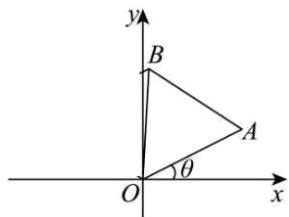

<!-- question-source:start -->
【典例1】（1）写出复数 $1 - \sqrt{3}\mathrm{i}$ 的三角形式.

(2) 在复数集内解方程 $z^{6}=1$ .

(3) 如图，在复平面的上半平面内有一个等边三角形 $OAB$ ，点 $A$ 所对应的复数是 $2 + \mathrm{i}$ ，求顶点 $B$ 所对应的

复数的代数形式.

<!-- question-source:end -->

![[高中/课堂同步/题库/人教A版高中数学同步讲义(2026)/02_必修第二册/第七章 复数/专题7.3 复数的三角表示（高效培优讲义）/题型06_复数的三角形式乘_除运算的几何意义/questions/answers/Q00077840A1.md]]
