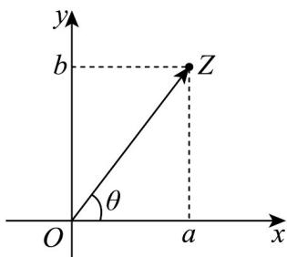

<!-- question-source:start -->
【变式2】我们知道，复数可以用 $a + \mathrm{bi}(a,b\in \mathbf{R})$ 的形式来表示，与复平面内的点 $Z(a,b)$ 是一一对应的，复数的模 $|z| = |a + \mathrm{bi}| = \sqrt{a^2 + b^2}$ ，即是复平面内的点 $Z(a,b)$ 到坐标原点 $O$ 的距离 $|OZ|$ 。又复数与平面向量 $\overline{OZ} = (a,b)$ 也是一一对应的，所以也可以借助与 $x$ 非负半轴为始边，以向量 $\overline{OZ}$ 所在射线（射线 $OZ$ ）为终边的角 $\theta$ 来刻画 $\overline{OZ}$ 的方向，在此基础上再来认识一下复数的乘除法运算。

如： $z_{1} = 1 + \sqrt{3}\mathrm{i}$ ， $\left|z_1\right| = 2$ ，角 $\theta_{1} = \frac{\pi}{6}$ ； $z_{2} = \sqrt{3} +\mathrm{i}$ ， $\left|z_2\right| = 2$ ，角 $\theta_{2} = \frac{\pi}{3}$ ，由 $z_{1}\cdot z_{2} = (1 + \sqrt{3}\mathrm{i})\times (\sqrt{3} +\mathrm{i}) = 4\mathrm{i}$ .即：复数 $z = z_{1}\cdot z_{2}$ ，相当于将复数 $z_{1}$ 伸长了 $\left|z_2\right|$ 倍，同时逆时针旋转角 $\theta_{2}$ 后得到.

(1) 计算 $\frac{a + b\mathrm{i}}{\mathrm{i}} (a,b\in \mathbf{R})$ ，并从模与角度的变化来解释除法运算的几何意义；

(2)现将直角坐标平面内任意一点 $P(x,y)$ ，绕坐标原点逆时针旋转 $\theta$ 角，并将 $|OP|$ 的长度伸长 $m$ 倍后得到点 $Q(x',y')$ 。请借助以上复数运算的知识，推导点 $P$ 与点 $Q$ 伸缩旋转变换的坐标关系；

(3)已知反比例函数 $C: y = \frac{1}{x}$ ，现将函数 C 上的点 $P(x, y)$ 都逆时针旋转 $45^{\circ}$ 后得到点 $Q(x', y')$ 的曲线 $C'$ ，求曲线 $C'$ 上的点 $Q(x', y')$ 坐标关系式。
<!-- question-source:end -->

![[高中/课堂同步/题库/人教A版高中数学同步讲义(2026)/02_必修第二册/第七章 复数/专题7.3 复数的三角表示（高效培优讲义）/题型06_复数的三角形式乘_除运算的几何意义/questions/answers/Q00077842A1.md]]
