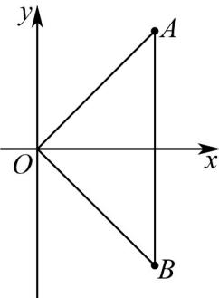

> [!faq]- 《第七章 复数（高效培优讲义）》官方解析
>
> > [!success]- **【答案】** (1) $(-2,0)$ (2) $-\frac{8}{5}$
>
> > [!note]- **【分析】**
> > （1）由已知得 $\alpha$ 、 $\beta$ 互为共轭复数，根据 $\left\{ \begin{array}{l} \Delta < 0 \\ \alpha \beta = \frac{a^2 - 2a}{2} \end{array} \right.$ ，再由模的计算公式可得 $a$ 的取值范围；
> >
> > (2) 根据题意 $\angle APB = 90^{\circ}$ , $OA = OB$ , 则 $\alpha = m + mi$ , $\beta = m - mi$ , 根据韦达定理可得 $\left\{ \alpha \beta = 2m^{2} = \frac{a^{2} - 2a}{2} \right.$ ,
> >
> > $$
> > \left\{ \begin{array}{l} \alpha + \beta = 2 m = - \frac {3 a}{2} \\ \alpha \beta = 2 m ^ {2} = \frac {a ^ {2} - 2 a}{2} \end{array} \right.
> > $$
> >
> > 可解问题·
>
> > [!note]- **【解析】**
> > （1）由已知得 $\alpha$ 、 $\beta$ 互为共轭复数，设 $\alpha = m + n\mathrm{i}(m, n \in \mathbf{R})$ ，则 $\beta = m - n\mathrm{i}$ ，
> >
> > 则 $\left\{ \begin{array}{l} \Delta = (3a)^2 - 4 \times 2(a^2 - 2a) < 0 \\ (m + n\mathrm{i})(m - n\mathrm{i}) = \frac{a^2 - 2a}{2} \end{array} \right.$ ，可得 $\left\{ \begin{array}{l} -16 < a < 0 \\ m^2 + n^2 = \frac{a^2 - 2a}{2} \end{array} \right.$ ，
> >
> > 又因为 $|\alpha| < 2$ ，即 $0 < m^2 + n^2 < 4$ ，则 $0 < \frac{a^2 - 2a}{2} < 4$
> >
> > 综合可得-2<a<0，即 $a\in(-2,0)$ ；
> >
> > (2) 根据题意，A, B 两点关于 x 轴对称，则 OA = OB
> >
> > 
> >
> > 又VAOB为等腰直角三角形，所以 $\angle AOB = 90^{\circ}$
> >
> > 所以 $A(m,m), B(m,-m)$ ，即 $\alpha = m + mi, \beta = m - mi$
> >
> > 根据韦达定理可得 $\left\{ \begin{array}{l} \alpha + \beta = 2m = -\frac{3a}{2} \\ \alpha \beta = 2m^2 = \frac{a^2 - 2a}{2} \end{array} \right.$
> >
> > 所以 $\left(-\frac{3a}{4}\right)^{2}=\frac{a^{2}-2a}{4}$ ，解得 $a=-\frac{8}{5}$ 或a=0（舍），
> >
> > 所以 $a = -\frac{8}{5}$ .
> >
> > 6. 复数 $2 + a\mathrm{i}$ 的共轭复数为 $b + b\mathrm{i}(a, b \in \mathbb{R})$ ，则 $a = (\quad)$ A. -1 B. 1 C. -2 D. 2
> >
> > 【答案】C
> >
> > 【分析】根据共轭复数的概念求解·
> >
> > 【详解】因为 $2 + a\mathrm{i}$ 的共轭复数为 $b + b\mathrm{i}(a,b\in \mathbb{R})$
> >
> > 所以 $b = 2, -a = b$ ，所以 $a = -2$
> >
> > 故选 **C**
