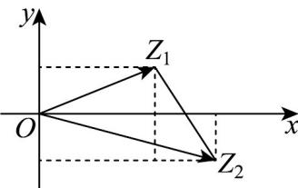

> [!faq]- 《第七章 复数（高效培优讲义）》官方解析
>
> > [!success]- **【答案】** B
>
> > [!note]- **【分析】**
> > 首先得到 $Z_{1}$ ， $Z_{2}$ 的坐标，得到 $\overline{Z_{1}Z_{2}}$ 的坐标，再求其模或直接利用两点之间的距离计算即得
>
> > [!note]- **【解析】**
> > 法一：因为 $z_{1} = 2 + \mathrm{i}$ ， $z_{2} = 3 - \mathrm{i}$ ，所以 $Z_{1}(2,1)$ ， $Z_{2}(3, - 1)$
> >
> > 所以 $\overline{Z_{1}Z_{2}}=(3,-1)-(2,1)=(1,-2)$ ，则 $\left|\overline{Z_{1}Z_{2}}\right|=\sqrt{1^{2}+(-2)^{2}}=\sqrt{5}$ ，即 $\left|Z_{1}Z_{2}\right|=\sqrt{5}$ .
> >
> > 法二：如图，在坐标系内做出复数 $z_{1}$ ， $z_{2}$ 对应的点为 $Z_{1}(2,1)$ ， $Z_{2}(3, - 1)$
> >
> > 由勾股定理易得 $\left|Z_{1}Z_{2}\right|=\sqrt{(3-2)^{2}+(-1-1)^{2}}=\sqrt{5}$
> >
> > 故选：B.
> >
> > 
