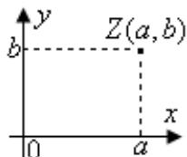

## 知识点 03 复数的几何意义

1、复平面、实轴、虚轴：

如图所示，复数 $z = a + bi(a,b\in R)$ 可用点 $Z(a,b)$ 表示，这个建立了直角坐标系来表示复数的平面叫做复平面，

也叫高斯平面， $x$ 轴叫做实轴， $y$ 轴叫做虚轴

知识点诠释：实轴上的点都表示实数．除了原点外，虚轴上的点都表示纯虚数．

2、复数集与复平面内点的对应关系

按照复数的几何表示法，每一个复数有复平面内唯一的一个点和它对应；反过来，复平面内的每一个点，有

唯一的一个复数和它对应.

复数集 $C$ 和复平面内所有的点所成的集合是一一对应关系，即

$$
\boxed {\text {复数}} z = a + b i \xleftarrow {- - \text {对应}} \boxed {\text {复平面内的点}} Z (a, b)
$$

这是复数的一种几何意义.

3、复数集与复平面中的向量的对应关系

在平面直角坐标系中，每一个平面向量都可以用一个有序实数对来表示，而有序实数对与复数是一一对应的，

所以，我们还可以用向量来表示复数。

设复平面内的点 $Z(a,b)$ 表示复数 $z = a + bi$ $(a,b\in R)$ ，向量 $\stackrel{\mathrm{UUU}}{OZ}$ 由点 $Z(a,b)$ 唯一确定；反过来，点 $Z(a,b)$ 也

可以由向量 $^{OZ}$ 唯一确定.

复数集 $C$ 和复平面内的向量 $\overline{OZ}$ 所成的集合是一一对应的，即

$$
\boxed {\text {复数}} z = a + b i \xleftarrow {\text {一一对应}} \boxed {\text {平面向量}} \overrightarrow {O Z}
$$

这是复数的另一种几何意义.

4、复数的模

设 $OZ = a + bi (a, b \in R)$ ，则向量 $OZ$ 的长度叫做复数 $z = a + bi$ 的模，记作 $|a + bi|$ . $|z|=|OZ|=\sqrt{a^{2}+b^{2}}\quad0$

知识点诠释：

①两个复数不全是实数时不能比较大小，但它们的模可以比较大小。

② 复平面内，表示两个共轭复数的点关于 $x$ 轴对称，并且他们的模相等。
