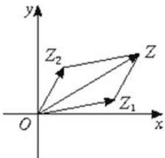

## 知识点 02 复数的加减运算的几何意义

1、复数的表示形式：

代数形式： $z = a + bi$ （ $a, b \in R$ ）

几何表示：

①坐标表示：在复平面内以点 $Z(a,b)$ 表示复数 $z = a + bi$ （ $a,b \in R$ ）；

② 向量表示：以原点 $O$ 为起点，点 $Z(a,b)$ 为终点的向量 $\overline{OZ}$ 表示复数 $z = a + bi$

2、复数加、减法的几何意义：

如果复数 $z_{1}$ 、 $z_{2}$ 分别对应于向量 $\stackrel{\square\square\square}{OP_1}$ 、 $\stackrel{\square\square\square\square}{OP_2}$ ，那么以 $OP_{1}$ 、 $OP_{2}$ 为两边作平行四边形 $OP_{1}SP_{2}$ ，对角线 $OS$ 表示

的向量 $OS$ 就是 $z_{1} + z_{2}$ 的和所对应的向量. 对角线 $P_{2}P_{1}$ 表示的向量 $P_{2}P_{1}$ 就是两个复数的差 $z_{1} - z_{2}$ 所对应的向量.

设复数 $z_{1} = a + bi$ ， $z_{2} = c + di$ ，在复平面上所对应的向量为 $\overline{OZ}_{1}$ 、 $\overline{OZ}_{2}$ ，即 $\overline{OZ}_{1}$ 、 $\overline{OZ}_{2}$ 的坐标形式为

$\overline{OZ}_{1}=(a,b)$ ， $\overline{OZ}_{2}=(c,d)$ 。以 $\overline{OZ}_{1}$ 、 $\overline{OZ}_{2}$ 为邻边作平行四边形 $OZ_{1}ZZ_{2}$ ，则对角线OZ对应的向量是 $\overline{OZ}$

由于 $\overline{OZ}=\overline{OZ_{1}}+\overline{OZ_{2}}=(a,b)+(c,d)=(a+c,b+d)$ ，所以 $\overline{OZ_{1}}$ 和 $\overline{OZ_{2}}$ 的和就是与复数 $(a+c)+(b+d)i$ 对应的向

量.

【即学即练】

1. 设复数 $z$ 满足 $\left|z - 3 - 4\mathrm{i}\right| \leq 1$ ，求：

(1) $\left|z\right|$ 的取值范围；

(2) $\left|z+1-i\right|$ 的最大值.

【答案】(1)[4,6] (2)6

【分析】（1）满足不等式 $|z - 3 - 4\mathrm{i}| \leq 1$ 的复数 $z$ 所对应的点在以 $A(3,4)$ 为圆心，1为半径的圆上及圆内，利用几何图形求解该圆上点到原点距离的范围即为 $|z|$ 的取值范围；

(2) $\left|z+1-\mathrm{i}\right|$ 代表满足已知圆及圆内点到 $P(-1,1)$ 的距离，利用几何图形求解即可·

【详解】（1）满足不等式 $\left|z-3-4\mathrm{i}\right|\leq1$ 的复数z所对应的点在以 $A(3,4)$ 为圆心， $^{1}$ 为半径的圆上及圆内，如图所示·

(1) 解法 $1: |z|$ 代表满足已知圆及圆内点到原点的距离，因此距离最大值为圆心到原点的距离 $^5$ 加半径 $^1$ ，最小值为圆心到原点的距离 $^5$ 减半径 $^1$ ，即 $|z| \in [4,6]$ .

解法2：由不等式 $\left\| z_1\right| - \left|z_2\right|\leq \left|z_1 - z_2\right|\leq \left|z_1\right| + \left|z_2\right|$ ，得 $\left\| z\right| - \left|3 + 4\mathrm{i}\right|\leq \left|z - 3 - 4\mathrm{i}\right|\leq 1$ ，即 $\left\| z\right| - 5\mid \leq 1$ ，解得 $|z|\in [4,6]$

(2) (2) $\left|z+1-i\right|$ 代表满足已知圆及圆内点到 $P(-1,1)$ 的距离，所以点 $A(3,4)$ 到点 $P(-1,1)$ 的距离为 $AP=\sqrt{(3+1)^{2}+(4-1)^{2}}=5$ ，所以 $|z+1-i|\in[4,6]$ ，即最大值为6.

2．已知复数 $z_{1}$ ， $z_{2}$ 满足 $z_{1}=\mathrm{i}z_{2}$ 且 $z_{1}\overline{z_{1}}=1$ ，则对于任意的复数z， $\sqrt{2}|z-z_{1}|+|z-z_{2}|+|z+z_{2}|$ 的最小值为\_\_\_\_。
【答案】 $2\sqrt{2}$

【分析】根据题意可得 $a^{2}+b^{2}=1$ ，简化运算，不妨设 $z_{1}=1,z_{2}=-i$ ，利用复数的几何意义转化为

$\sqrt{2}\left|PA\right| + \left|PB\right| + \left|PC\right|$ ，根据加权费马定理求最小值即可·

【详解】设 $z_{1} = a + bi(a, b \in \mathbb{R})$ ，因为 $z_{1}\overline{z_{1}} = 1$

所以 $z_{1}\overline{z_{1}}=(a+bi)(a-bi)=a^{2}+b^{2}=1$ ， $z_{2}=\frac{z_{1}}{i}=b-ai$ ，

根据对称性，不妨取 $z_{1}=1, z_{2}=-i$ ，

则 $\left|z-z_{1}\right|,\left|z-z_{2}\right|,\left|z+z_{2}\right|$ 的几何意义为复平面中到点 $A(1,0),B(0,-1),C(0,1)$ 的距离，∴ $\sqrt{2}\left|z-z_{1}\right|+\left|z-z_{2}\right|+\left|z+z_{2}\right|=\sqrt{2}\left|PA\right|+\left|PB\right|+\left|PC\right|$

如图，将 $\triangle ACP$ 顺时针旋转 $90^{\circ}$ 得到VADE， $D(2,1)$ ，

则 $AP \perp AE, AP = AE$ ，所以 $PE = \sqrt{2} PA$

又 $\triangle ACP \cong \triangle ADE$ ，所以 PC = ED，

所以 $\sqrt{2}|PA|+|PB|+|PC|=|PE|+|PB|+|ED|\quad|BD|=2\sqrt{2}$

故答案为： $2\sqrt{2}$
