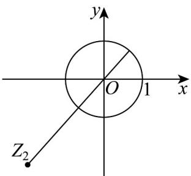

> [!faq]- 《专题7_2_复数的四则运算_高效培优讲义_》官方解析
>
> > [!success]- **【答案】** [2,4]
>
> > [!note]- **【分析】**
> > 利用复数的几何意义，将 $\left|z+2+\sqrt{5}\mathrm{i}\right|$ 转化为点 $(-2,-\sqrt{5})$ 到圆上的距离问题，进而利用圆心 $(0,0)$ 到点 $(-2,-\sqrt{5})$ 距离可得 $\left|z+2+\sqrt{5}\mathrm{i}\right|$ 的取值范围.
>
> > [!note]- **【解析】**
> > $|z| = 1$ 表示 $z$ 对应的点 $Z_{1}$ 是以原点 $O$ 为圆心，半径 $r = 1$ 的圆上的点，
> >
> > $\left|z + 2 + \sqrt{5}\mathrm{i}\right| = \left|z - (-2 - \sqrt{5}\mathrm{i})\right|$ 的几何意义表示圆 $O$ 上的点 $Z_{1}$ 和 $Z_{2}(-2, - \sqrt{5})$ 之间的距离，
> >
> > 于是， $\left|z+2+\sqrt{5}\mathrm{i}\right|$ 的最大值为 $\left|OZ_{2}\right|+r=\sqrt{(0+2)^{2}+\left(0+\sqrt{5}\right)^{2}}+1=4$
> >
> > 最小值为 $\left|OZ_{2}\right|-r=\sqrt{(0+2)^{2}+\left(0+\sqrt{5}\right)^{2}}-1=2$
> >
> > 所以 $\left|z+2+\sqrt{5}i\right|$ 的取值范围是 $[2,4]$ .
> >
> > 
> >
> > 故答案为： $[2,4]$ .
