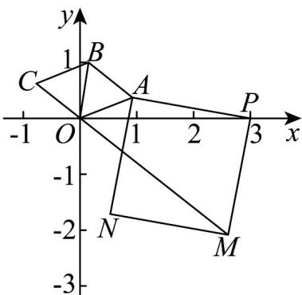

<!-- question-source:start -->
【变式1】我们知道复数有三角形式 $z = r(\cos \theta +\mathrm{i}\sin \theta)$ ，其中 $r$ 为复数的模， $\theta$ 为辐角主值·由复数的三角形

式可得出，若 $OZ_{1} = r_{1}\left(\cos \theta_{1} + \mathrm{i}\sin \theta_{1}\right)$ ， $OZ_{2} = r_{2}\left(\cos \theta_{2} + \mathrm{i}\sin \theta_{2}\right)$ ，则

$r_1(\cos \theta_1 + \mathrm{i}\sin \theta_1)\cdot r_2(\cos \theta_2 + \mathrm{i}\sin \theta_2) = r_1r_2[\cos (\theta_1 + \theta_2) + \mathrm{i}\sin (\theta_1 + \theta_2)]$ 其几何意义是把向量 $OZ_{1}$ 绕点 $O$ 按逆时

针方向旋转角 $\theta_{2}$ （如果 $\theta_{2} < 0$ ，就要把 $OZ_{1}$ 绕点 $O$ 按顺时针方向旋转角 $\left|\theta_{2}\right|$ ），再把它的模变为原来的 $r_2$ 倍

已知在复平面的上半平面内有一个菱形 $OABC$ ，其边长为 $1$ ， $\angle AOC = 120^{\circ}$ ，点 $A, B, C$ 所对应的复数分别为 $z_{1}$ ， $z_{2}, z_{3}$ 。

(1)若 $z_{1} = \frac{\sqrt{3}}{2} +\frac{1}{2}\mathrm{i}$ ，求出 $z_{2}$ ， $z_{3}$ ；

(2)如图，若 $P(3,0)$ ，以 $PA$ 为边作正方形APMN.

(i) 若 $M, N$ 在 $AP$ 下方，是否存在复数 $z_{1}$ 使得 $OM$ 长度为 $\sqrt{19 - 6\sqrt{2}}$ ，若存在，求出复数 $z_{1}$ ；若不存在，说

明理由；

(ii) 若 M, N 在 AP 上方，且向量 $\sqrt{xy}PM = xOA + yOC$ ，求证： $5 \leq \frac{y}{x} + \frac{x}{y} \leq 8$ .
<!-- question-source:end -->

![[高中/课堂同步/题库/人教A版高中数学同步讲义(2026)/02_必修第二册/第七章 复数/讲义/专题7_3_复数的三角表示_高效培优讲义_/题型06_复数的三角形式乘_除运算的几何意义_sec_12/questions/answers/Q00064643A1.md]]
