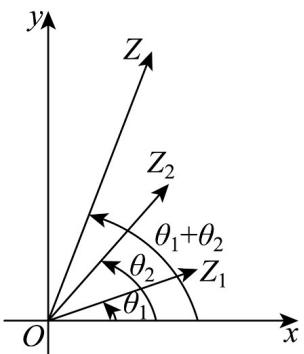

<!-- question-source:start -->
【变式3】两个复数相乘时，如图所示，先画出与 $z_{1},z_{2}$ 对应的向量 $OZ_{1}$ ， $OZ_{2}$ ，然后把向量 $OZ_{1}$ 绕点O按—

时针方向旋转角 $\theta_{2}$ ，（如果 $\theta_{2} < 0$ ，就要把 $OZ_{1}$ 绕点 $O$ 按\_\_\_\_时针方向旋转 $\left|\theta_{2}\right|$ ），再把它的模变为原来的\_

倍，得到向量 $\overline{OZ}$ ， $\overline{OZ}$ 表示的复数就是积\_\_\_\_，这是复数乘法的几何意义。

<!-- question-source:end -->

![[高中/课堂同步/题库/人教A版高中数学同步讲义(2026)/02_必修第二册/第七章 复数/讲义/专题7_3_复数的三角表示_高效培优讲义_/题型06_复数的三角形式乘_除运算的几何意义_sec_12/questions/answers/Q00064645A1.md]]
