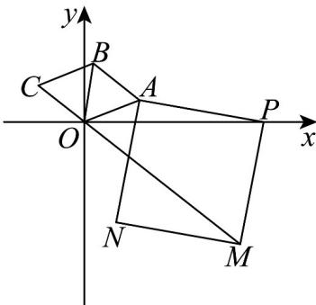
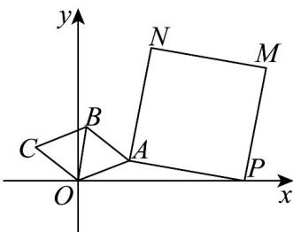

> [!faq]- 《专题7_3_复数的三角表示_高效培优讲义_》官方解析
>
> > [!success]- **【答案】** (1) $z_{2}=i$ ， $z_{3}=-\frac{\sqrt{3}}{2}+\frac{1}{2}i$ (2)(i)存在， $z_{1}=\frac{\sqrt{2}}{2}+\frac{\sqrt{2}}{2}i$ ；(ii)证明见解析
>
> > [!note]- **【分析】**
> > （1）根据复数三角形式运算的几何意义与运算法则求复数 $z_{2}$ ， $z_{3}$ ·
> >
> > (2) (i) 设 $z_{1} = \cos \alpha + \mathrm{i}\sin \alpha$ ， $0 \leq \alpha \leq \frac{\pi}{3}$ ，借助复数三角形式的运算，用 $\alpha$ 表示出点 $M$ 的坐标，求 $OM$ 的长度，根据 $OM$ 长度为 $\sqrt{19 - 6\sqrt{2}}$ ，看看 $\alpha$ 是否存在即可。
> >
> > （ii）根据 $\sqrt{xy} PM = xOA + yOC$ ，把 $\frac{y}{x} +\frac{x}{y}$ 表示成与 $\alpha$ 有关的三角函数，结合角 $\alpha$ 的取值范围，求函数值域
> >
> > 即可·
>
> > [!note]- **【解析】**
> > （1）连接 OB，因为四边形 OABC， $\angle AOC = 120^{\circ}$
> >
> > 所以 $\angle AOB = 60^{\circ}$ ，又 $OA = AB = BC = OC = 1$ ，所以 $OB = 1$ ，即
> >
> > 因为 $z_{1}=\frac{\sqrt{3}}{2}+\frac{1}{2}i=\cos\frac{\pi}{6}+i\sin\frac{\pi}{6}$
> >
> > 所以 $z_{2} = z_{1}\cdot \left(\cos \frac{\pi}{3} +\mathrm{i}\sin \frac{\pi}{3}\right) = \left(\cos \frac{\pi}{6} +\mathrm{i}\sin \frac{\pi}{6}\right)\cdot \left(\cos \frac{\pi}{3} +\mathrm{i}\sin \frac{\pi}{3}\right) = \cos \frac{\pi}{2} +\mathrm{i}\sin \frac{\pi}{2} = \mathrm{i}$
> >
> > $$
> > z _ {3} = z _ {1} \cdot \left(\cos \frac {2 \pi}{3} + \mathrm{i} \sin \frac {2 \pi}{3}\right) = \left(\cos \frac {\pi}{6} + \mathrm{i} \sin \frac {\pi}{6}\right) \cdot \left(\cos \frac {2 \pi}{3} + \mathrm{i} \sin \frac {2 \pi}{3}\right) = \cos \frac {5 \pi}{6} + \mathrm{i} \sin \frac {5 \pi}{6}
> > $$
> >
> > 所以 $z_{2}=i$ ， $z_{3}=-\frac{\sqrt{3}}{2}+\frac{1}{2}i$ .
> >
> > (2) 设 $z_{1} = \cos \alpha + \mathrm{i}\sin \alpha$ ， $0 \leq \alpha \leq \frac{\pi}{3}$ ，则 $z_{3} = \cos \left(\alpha + \frac{2\pi}{3}\right) + \mathrm{i}\sin \left(\alpha + \frac{2\pi}{3}\right)$
> >
> > 设 $PA$ 对应的复数为 $z_{4}$ ，则 $z_{4} = (\cos \alpha - 3) + i \sin \alpha$
> >
> > 
> >
> > (i) 设 $\overline{PM}$ 对应的复数为 $z_{5}$ ， $z_{5}=z_{4}\cdot\left(\cos\frac{\pi}{2}+\mathrm{i}\sin\frac{\pi}{2}\right)=\left[\left(\cos\alpha-3\right)+\mathrm{i}\sin\alpha\right]\mathrm{i}=-\sin\alpha+\mathrm{i}\left(\cos\alpha-3\right)$
> >
> > 设 $OM$ 对应的复数为 $z_{6}$ ，所以 $z_{6} = 3 - \sin \alpha + \mathrm{i}(\cos \alpha - 3)$
> >
> > 所以 $\left|z_6\right| = \sqrt{\left(3 - \sin\alpha\right)^2 + \left(\cos\alpha - 3\right)^2} = \sqrt{19 - 6\left(\sin\alpha + \cos\alpha\right)}$
> >
> > 由已知可得 $\sqrt{19 - 6(\sin\alpha + \cos\alpha)} = \sqrt{19 - 6\sqrt{2}}$
> >
> > 所以 $\sin\alpha+\cos\alpha=\sqrt{2}\sin\left(\alpha+\frac{\pi}{4}\right)=\sqrt{2}$ ，又 $0\leq\alpha\leq\frac{\pi}{3}$ ，所以 $\alpha=\frac{\pi}{4}$ ，所以 $z_{1}=\frac{\sqrt{2}}{2}+\frac{\sqrt{2}}{2}i$
> >
> > (ii) 设 PM 对应的复数为 $z_{7}$ ,
> >
> > 所以 $z_{7}=z_{4}\cdot\left(\cos\left(-\frac{\pi}{2}\right)+\mathrm{i}\sin\left(-\frac{\pi}{2}\right)\right)=\left[\left(\cos\alpha-3\right)+\mathrm{i}\sin\alpha\right]\cdot\left(-\mathrm{i}\right)=\sin\alpha+\mathrm{i}\left(3-\cos\alpha\right)$
> >
> > 所以 $\overline{PM} = (\sin \alpha, 3 - \cos \alpha)$ ，又 $\overline{OA} = (\cos \alpha, \sin \alpha)$ ， $\overline{OC} = (\cos \left(\alpha + \frac{2\pi}{3}\right), \sin \left(\alpha + \frac{2\pi}{3}\right))$ ， $\sqrt{xyPM} = xOA + yOC$
> >
> > $$
> > x y \left[ \sin^ {2} \alpha + (3 - \cos \alpha) ^ {2} \right] = \left[ x \cos \alpha + y \cos \left(\alpha + \frac {2 \pi}{3}\right) \right] ^ {2} + \left[ x \sin \alpha + y \sin \left(\alpha + \frac {2 \pi}{3}\right) \right] ^ {2}
> > $$
> >
> > 所以 $xy(10 - 6\cos \alpha) = x^2 +y^2 +2xy\left[\cos \alpha \cos \left(\alpha +\frac{2\pi}{3}\right) + \sin \alpha \sin \left(\alpha +\frac{2\pi}{3}\right)\right]$
> >
> > 所以 $xy(10 - 6\cos \alpha) = x^2 + y^2 - xy$ ，所以 $\frac{x}{y} + \frac{y}{x} = 11 - 6\cos \alpha$ ，又 $\frac{1}{2} \leq \cos \alpha \leq 1$
> >
> > 
> >
> > 所以 $5 \leq \frac{x}{y} + \frac{y}{x} \leq 8$ ，所以 $\frac{y}{x} + \frac{x}{y}$ 的范围为 $[5, 8]$ .
