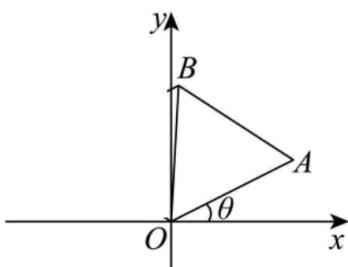

## 题型06 复数的三角形式乘、除运算的几何意义

【典例1】（1）写出复数 $1 - \sqrt{3}\mathrm{i}$ 的三角形式.

(2) 在复数集内解方程 $z^{6}=1$ .

(3) 如图，在复平面的上半平面内有一个等边三角形 $OAB$ ，点 $A$ 所对应的复数是 $2 + \mathrm{i}$ ，求顶点 $B$ 所对应的

复数的代数形式.

【答案】（1） $2\left[\cos\left(-\frac{\pi}{3}\right)+\mathrm{i}\sin\left(-\frac{\pi}{3}\right)\right]$ ；（2） $z_{1}=1,\quad z_{2}=-1,\quad z_{3}=-\frac{1}{2}+\frac{\sqrt{3}}{2}\mathrm{i},\quad z_{4}=-\frac{1}{2}-\frac{\sqrt{3}}{2}\mathrm{i}$

$$
z _ {5} = \frac {1}{2} + \frac {\sqrt {3}}{2} \mathrm{i}, z _ {6} = \frac {1}{2} - \frac {\sqrt {3}}{2} \mathrm{i}; (3) 1 - \frac {\sqrt {3}}{2} + \left(\frac {1}{2} + \sqrt {3}\right) \mathrm{i}
$$

【分析】（1）根据复数三角形式定义直接求解；

(2) 根据复数定义直接求解；

(3) 作出图形，根据 $\triangle OAB$ 为等边三角形，将点 $A$ 对应的复数表示为 $2 + \mathrm{i} = \sqrt{5} (\cos \theta + \mathrm{i}\sin \theta)$ ，利用复数旋

转可得出点 $B$ 所对应的复数为 $\sqrt{5}\left[\cos (\theta +60^{\circ}) + \mathrm{i}\sin (\theta +60^{\circ})\right]$ ，利用两角和的正弦、余弦公式求出 $\theta +60^{\circ}$ 的

正弦值和余弦值，即可得出点 $B$ 所对应的复数。

【详解】（1） $1-\sqrt{3}\mathrm{i}=2\left[\cos\left(-\frac{\pi}{3}\right)+\mathrm{i}\sin\left(-\frac{\pi}{3}\right)\right]$ ，

(2) 因为 $z^{6}=1$ ，所以 $\left(z^{3}-1\right)\left(z^{3}+1\right)=0$

$$
\text {即} (z - 1) \left(z ^ {2} + z + 1\right) (z + 1) \left(z ^ {2} - z + 1\right) = 0
$$

$$
\text {人} (z - 1) \left[ \left(z + \frac {1}{2}\right) ^ {2} + \frac {3}{4} \right] (z + 1) \left[ \left(z - \frac {1}{2}\right) ^ {2} + \frac {3}{4} \right] = 0
$$

解得 $z_{1} = 1$ ， $z_{2} = -1$ ， $z_{3} = -\frac{1}{2} +\frac{\sqrt{3}}{2}\mathrm{i}$ ， $z_{4} = -\frac{1}{2} -\frac{\sqrt{3}}{2}\mathrm{i}$ ， $z_{5} = \frac{1}{2} +\frac{\sqrt{3}}{2}\mathrm{i}$ ， $z_{6} = \frac{1}{2} -\frac{\sqrt{3}}{2}\mathrm{i}$

(3) 如图，由题意可知， $\triangle OAB$ 为等边三角形.

又 $OA = 2 + i = \sqrt{5} (\cos\theta + i\sin\theta)$ ，其中 $\theta$ 为 OA 的辐角。

将 $OA$ 绕原点 $O$ 按逆时针方向旋转 $60^{\circ}$ 可得 $OB$

$$
\overline {{O B}} = \sqrt {5} (\cos \theta + \mathrm{i} \sin \theta) (\cos 6 0 ^ {\circ} + \mathrm{i} \sin 6 0 ^ {\circ}) = \sqrt {5} [ \cos (\theta + 6 0 ^ {\circ}) + \mathrm{i} \sin (\theta + 6 0 ^ {\circ}) ]
$$

$$
\text {又} \cos \theta = \frac {2}{\sqrt {5}} \quad , \sin \theta = \frac {1}{\sqrt {5}} \quad , \therefore \cos (\theta + 6 0 ^ {\circ}) = \frac {1}{2} \cos \theta - \frac {\sqrt {3}}{2} \sin \theta = \frac {2 - \sqrt {3}}{2 \sqrt {5}}
$$

$$
\sin (\theta + 6 0 ^ {\circ}) = \frac {1}{2} \sin \theta + \frac {\sqrt {3}}{2} \cos \theta = \frac {1 + 2 \sqrt {3}}{2 \sqrt {5}}
$$

$\overrightarrow{OB}=1-\frac{\sqrt{3}}{2}+\left(\frac{1}{2}+\sqrt{3}\right)\mathrm{i},\therefore_{B}$ 所对应的复数为 $1-\frac{\sqrt{3}}{2}+\left(\frac{1}{2}+\sqrt{3}\right)\mathrm{i}$

## 方法技巧

复数的三角形式乘、除运算的几何意义的注意事项

1、复数乘法几何意义是解题关键．把复数 z 对应的向量 $\overline{OZ}$ 绕原点逆时针旋转 $z_{0}$ 的一个辐角，长度乘以 $z_{0}$

的模，所得向量对应的复数就是 $z \cdot z_0$

2、复数除法几何意义是解题关键．把复数 z 对应的向量 $\overline{OZ}$ 绕原点顺时针旋转 $z_{0}$ 的一个辐角，长度除以 $z_{0}$

的模，所得向量对应的复数就是 $Z_{0}$

$$
\frac {z}{z _ {0}}
$$

![[高中/课堂同步/题库/人教A版高中数学同步讲义(2026)/02_必修第二册/第七章 复数/讲义/专题7_3_复数的三角表示_高效培优讲义_/题型06_复数的三角形式乘_除运算的几何意义_sec_12/questions/Q00064643.md]]
![[高中/课堂同步/题库/人教A版高中数学同步讲义(2026)/02_必修第二册/第七章 复数/讲义/专题7_3_复数的三角表示_高效培优讲义_/题型06_复数的三角形式乘_除运算的几何意义_sec_12/questions/Q00064644.md]]
![[高中/课堂同步/题库/人教A版高中数学同步讲义(2026)/02_必修第二册/第七章 复数/讲义/专题7_3_复数的三角表示_高效培优讲义_/题型06_复数的三角形式乘_除运算的几何意义_sec_12/questions/Q00064645.md]]
