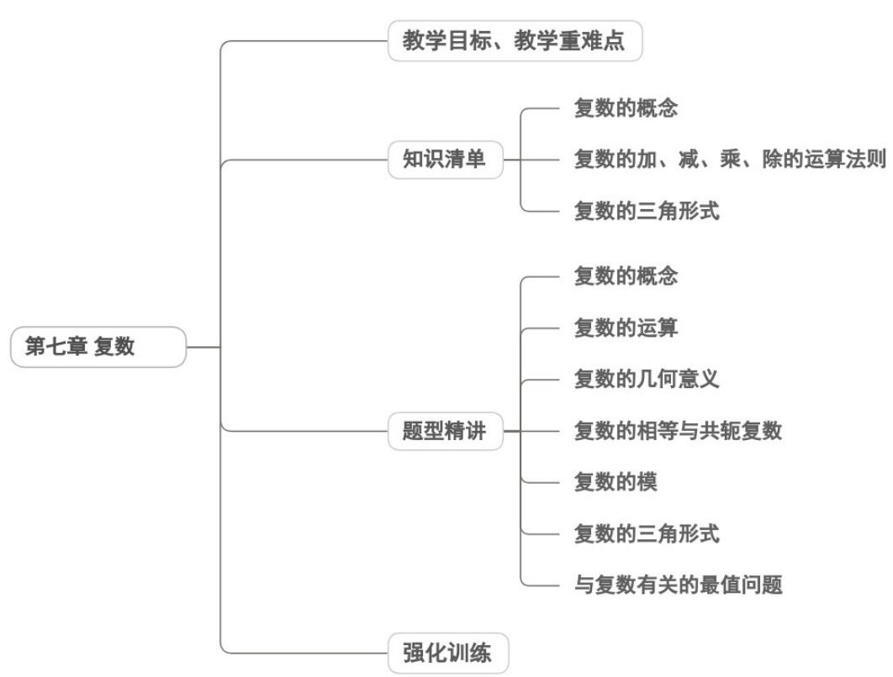

<!-- source-part:1 pages:1-43 -->

## 第七章 复数

## 教学目标、教学重难点

<table><tr><td>教学目标</td><td>1.理解数系扩充的逻辑:从实数范围内无解方程(如 $x^{2}+1=0$ )的矛盾出发,体会引入虚数单位i的必要性,掌握 $i^{2}=-1$ 的核心性质,明确复数集是实数集的自然扩充,构建“自然数集→整数集→有理数集→实数集→复数集”的完整数系框架。2.掌握复数的核心概念:熟练掌握复数的代数形式 $z=a+bi(a,b\in\mathbb{R})$ ,明确实部a、虚部=b的定义;能准确区分实数(b=0)、虚数(b≠0)、纯虚数(a=0且b≠0</td></tr><tr><td></td><td>),理解复数集、实数集、虚数集、纯虚数集的包含关系;掌握复数相等的充要条件 $(a + bi = c + di \quad a = c \text{且} b = d)$ ,明确复数不能比较大小的本质(仅实数可比较大小)。3.熟练运用复数运算体系:掌握复数代数形式的四则运算法则,加法遵循“实部相加、虚部分相加”,减法为其逆运算;乘法类比多项式乘法(利用 $i^{2} = -1$ 化简);除法通过“分母实数化”(乘以分母的共轭复数)转化为乘法运算;理解共轭复数 $\overline{z} = a - bi$ 的性质(如 $\overline{z_{1} \pm z_{2}} = \overline{z_{1}} \pm \overline{z_{2}}$ 、 $z \cdot \overline{z} = |z|^{2}$ ),掌握复数模 $|z| = \sqrt[4]{a^{2} + b^{2}}$ 的计算及运算性质(如 $|z_{1} \cdot z_{2}| = |z_{1}| \cdot |z_{2}|$ )。4.把握复数的几何意义:理解复数与复平面内点 $Z(a,b)$ 、以原点为起点的向量 $\overrightarrow{OZ}$ 的一一对应关系;明确复数模的几何意义(复平面内点到原点的距离),能解释复数加减运算的几何意义(向量的合成与分解);能利用几何意义解决简单问题(如求复平面内满足特定模条件的点的轨迹)。5.具备综合应用能力:能在复数范围内解一元二次方程(含判别式小于0的情况),进行多项式因式分解;能结合实例说明复数在数学、物理(如交流电、波动理论)等领域的应用,初步建立复数模型解决简单问题。</td></tr><tr><td>教学重难点</td><td>重点1.复数的核心概念体系:重点掌握复数的代数形式 $a+bi$ 、实部与虚部的定义、复数的分类标准,以及复数相等的充要条件,这是后续学习的基础。2.复数的四则运算规则:重中之重是复数乘法的多项式展开与化简、除法的分母实数化方法,以及共轭复数、复数模的运算性质,确保运算的准确性与规范性。3.复数的几何意义:核心是复数与复平面内点、向量的一一对应关系,以及复数模的几何表征,这是数形结合思想应用的关键。4.数系扩充的逻辑与思想:理解数系扩充的必要性与基本原则,建立“运算封闭性”的数学思维,体会类比、转化等数学思想方法的价值。难点1.抽象概念的深层理解:难点在于虚数单位 $i$ 的本质把握(既不是实数,又满足 $i^{2}=-1$ 的特殊性质);复数“不能比较大小”的逻辑根源(缺乏像实数那样的全序关系);纯虚数与虚数的区别(纯虚数需满足“实部为0且虚部不为0”的双重条件)。2.运算规则的准确应用:复数乘法中 $i^{2}=-1$ 的正确化简(易误将 $i^{2}$ 等同于1);除法运算中分母实数化的步骤规范(忘记乘以共轭复数或计算出错);共轭复数与复数模的运算性质灵活运用(如忽视 $z\cdot\bar{z}=|z|^{2}$ 的转化价值)。3.几何意义的融会贯通:难点在于将复数运算与复平面内的向量运动关联(如复数加</td></tr></table>

法对应向量平行四边形法则）；利用复数模的几何意义解决轨迹问题（如 $|z-(2+i)|=1$ 对应圆的方程）；区分复数坐标与平面直角坐标系中点坐标的联系与差异。
4. 数系扩充的思维突破：学生易受实数运算经验的负迁移影响（如试图比较任意两个复数的大小），难以理解数系扩充后“运算封闭性”的新要求，需突破传统实数思维的局限。

![[高中/课堂同步/题库/人教A版高中数学同步讲义(2026)/02_必修第二册/第七章 复数/讲义/第七章_复数_高效培优讲义_/知识清单_sec_01/知识清单_sec_01.md]]
![[高中/课堂同步/题库/人教A版高中数学同步讲义(2026)/02_必修第二册/第七章 复数/讲义/第七章_复数_高效培优讲义_/知识点_01_复数的概念_sec_02/知识点_01_复数的概念_sec_02.md]]
![[高中/课堂同步/题库/人教A版高中数学同步讲义(2026)/02_必修第二册/第七章 复数/讲义/第七章_复数_高效培优讲义_/即学即练_sec_03/即学即练_sec_03.md]]
![[高中/课堂同步/题库/人教A版高中数学同步讲义(2026)/02_必修第二册/第七章 复数/讲义/第七章_复数_高效培优讲义_/知识点_02_复数的加_减_乘_除的运算法则_sec_04/知识点_02_复数的加_减_乘_除的运算法则_sec_04.md]]
![[高中/课堂同步/题库/人教A版高中数学同步讲义(2026)/02_必修第二册/第七章 复数/讲义/第七章_复数_高效培优讲义_/即学即练_sec_05/即学即练_sec_05.md]]
![[高中/课堂同步/题库/人教A版高中数学同步讲义(2026)/02_必修第二册/第七章 复数/讲义/第七章_复数_高效培优讲义_/知识点_03_复数的三角形式_sec_06/知识点_03_复数的三角形式_sec_06.md]]
![[高中/课堂同步/题库/人教A版高中数学同步讲义(2026)/02_必修第二册/第七章 复数/讲义/第七章_复数_高效培优讲义_/题型精讲_sec_07/题型精讲_sec_07.md]]
![[高中/课堂同步/题库/人教A版高中数学同步讲义(2026)/02_必修第二册/第七章 复数/讲义/第七章_复数_高效培优讲义_/题型01_复数的概念_sec_08/题型01_复数的概念_sec_08.md]]
![[高中/课堂同步/题库/人教A版高中数学同步讲义(2026)/02_必修第二册/第七章 复数/讲义/第七章_复数_高效培优讲义_/题型02_复数的运算_sec_09/题型02_复数的运算_sec_09.md]]
![[高中/课堂同步/题库/人教A版高中数学同步讲义(2026)/02_必修第二册/第七章 复数/讲义/第七章_复数_高效培优讲义_/题型03_复数的几何意义_sec_10/题型03_复数的几何意义_sec_10.md]]
![[高中/课堂同步/题库/人教A版高中数学同步讲义(2026)/02_必修第二册/第七章 复数/讲义/第七章_复数_高效培优讲义_/题型04_复数的相等与共轭复数_sec_11/题型04_复数的相等与共轭复数_sec_11.md]]
![[高中/课堂同步/题库/人教A版高中数学同步讲义(2026)/02_必修第二册/第七章 复数/讲义/第七章_复数_高效培优讲义_/题型06_复数的三角形式_sec_12/题型06_复数的三角形式_sec_12.md]]
![[高中/课堂同步/题库/人教A版高中数学同步讲义(2026)/02_必修第二册/第七章 复数/讲义/第七章_复数_高效培优讲义_/题型07_与复数有关的最值问题_sec_13/题型07_与复数有关的最值问题_sec_13.md]]
![[高中/课堂同步/题库/人教A版高中数学同步讲义(2026)/02_必修第二册/第七章 复数/讲义/第七章_复数_高效培优讲义_/强化训练_sec_14/强化训练_sec_14.md]]
