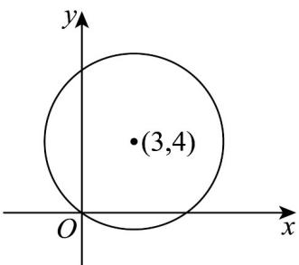

> [!faq]- 《第七章_复数_高效培优讲义_》官方解析
>
> > [!success]- **【答案】** A. 第一象限 B. 第二象限 C. 第三象限 D. 第四象限
>
> > [!note]- **【分析】**
> > 设 $z = x + yi, (x, y \in \mathbb{R})$ ，由已知得 z 在复平面的轨迹是以 $(3, 4)$ 为圆心，5 为半径的圆，由图即可判断。
>
> > [!note]- **【解析】**
> > 设 $z = x + yi, (x, y \in \mathbb{R})$ ，由 $\left|z - 3 - 4i\right| = 5$ 得 $(x - 3)^{2} + (y - 4)^{2} = 25$
> >
> > 可得 $z$ 在复平面上对应的点的轨迹是以 $(3,4)$ 为圆心， $5$ 为半径的圆，（如图）·
> >
> > 由图知圆 $\left(x - 3\right)^2 +\left(y - 4\right)^2 = 5$ 显然不经过第三象限，故复数 $z$ 在复平面上不可能位于第三象限
> >
> > 
> >
> > 故选 **C**.
