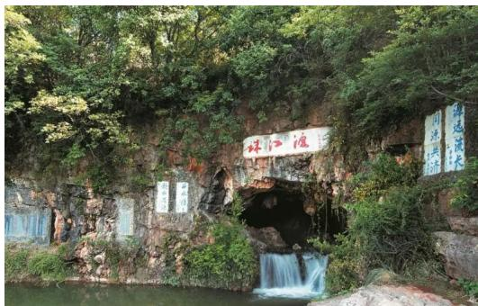

> [!faq]- 《专题02_分层抽样的四大常考题型_高效培优专项训练_数学人教A版高一必》官方解析
>
> > [!success]- **【答案】** ABC
>
> > [!note]- **【分析】**
> > 根据抽样的概念，每个个体被抽中的概率是均等的，即可求解.
>
> > [!note]- **【解析】**
> > 在抽签法抽样、随机数法抽样和分层随机抽样中，每个个体被抽中的概率均为 $\frac{n}{N}$
> >
> > 所以 $p_{1}=p_{2}=p_{3}$
> >
> > 故选：ABC.
> >
> > 24．珠江源位于云南东部曲靖市以北47公里处，整个景区由马雄山珠江源、花山湖和城区部分景点组成，总面积50平方公里.珠江源风景区是森林公园、省级风景名胜区、国际水利风景名胜区.景区森林茂密，溪流淙淙，有“一水滴三江，一脉隔双盘”的奇异景观。其美景吸引着大批的游客前往参观，某旅行社分年龄段统计了前往珠江源的老、中、青旅客的人数比为 $5:2:3$ ，现使用分层随机抽样的方法从这些旅客中随机抽取 $n$ 名，若青年旅客抽到 $90$ 人，则下列说法正确的是（）
> >
> > 【答案】
> >
> > 
> >
> > A. 被抽到的老年旅客和中年旅客人数之和超过 200
> > B. n=300
> > C. 中年旅客抽到 40 人
> > D. 老年旅客抽到 150 人
> >
> > 【答案】ABD
> >
> > 【分析】利用分层抽样的方法求出 $n$ ，然后分别求出各段抽取的人数逐项分析即可；
> > 【详解】由题意从这些旅客中随机抽取 $n$ 名，青年旅客抽到90人，则 $\frac{3}{5 + 2 + 3} \times n = 90$ ，所以 $n = 300$ ，故B正确；
> > 则中年旅客抽到 $\frac{2}{5 + 2 + 3} \times 300 = 60$ 人，故C错误；
> > 老年旅客抽到 $\frac{5}{5 + 2 + 3} \times 300 = 150$ 人，故D正确；
> > 被抽到的老年旅客和中年旅客人数之和为 $60 + 150 = 210$ 人超过200人，故A正确；
> > 故选：ABD
> >
> > 故选 **ABD**.
