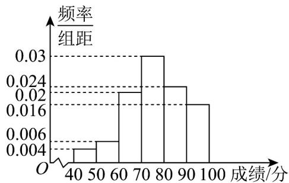

<!-- question-source:start -->
2．从高三抽出50名学生参加数学竞赛，由成绩得到如下的频率分布直方图．由于一些数据丢失，试利用频率分布直方图求：

(1)这 50 名学生成绩的众数与中位数；

(2)这 50 名学生的平均成绩.
<!-- question-source:end -->

![[高中/课堂同步/题库/人教A版高中数学同步讲义(2026)/02_必修第二册/第九章 统计/专项训练/专题03_频率分布直方图的五大常考题型_高效培优专项训练_数学人教A版/题型一_sec_02/questions/answers/Q00064778A1.md]]
